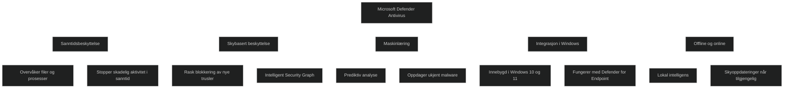

Microsoft Defender Antivirus er standard antivirusmotor i Windows 10 og Windows 11. Den bruker maskinlæring, big data analyse og skybasert intelligens for å oppdage og blokkere nye trusler i løpet av millisekunder. Den overvåker filer, prosesser og nettverkstrafikk i sanntid og fungerer både alene og som del av Microsoft Defender for Endpoint.

Viktige egenskaper:

- _Sanntidsbeskyttelse_ som overvåker filer, prosesser og nedlastinger.
- _Skybasert beskyttelse_ som gir rask respons på nye trusler.
- _Maskinlæring og prediktiv analyse_ for å stoppe ukjent malware.
- _Integrasjon med Intelligent Security Graph_ for global trusselintelligens.
- _Innebygd i Windows_, ingen installasjon nødvendig.
- _Støtte for både online og offline scenarier_ med oppdaterte signaturer.

For MD 102 er det viktig å forstå at Defender Antivirus er grunnlaget for neste generasjons beskyttelse og kreves for flere funksjoner i Attack Surface Reduction, Network Protection og Controlled Folder Access.

<a href="/certs/diagrams/defender-antivirus.html" target="_blank" rel="noopener">Stort diagram</a>

[Microsoft Defender Antivirus in Windows Overview - Microsoft Defender for Endpoint](https://learn.microsoft.com/en-us/defender-endpoint/microsoft-defender-antivirus-windows?utm_source=copilot.com)