Application Control er en sikkerhetsmekanisme som sørger for at _kun klarert og autorisert kode får kjøre i Windows_. Dette beskytter mot både kjente og ukjente trusler ved å endre tillitsmodellen fra _alt er tillatt med mindre det er kjent som skadelig_ til _ingenting er tillatt med mindre det er eksplisitt godkjent_.

Microsoft Defender Application Control (WDAC) bruker signaturer, filhash, filbane, sertifikater, omdømme og administrert installasjon for å avgjøre hva som får kjøre. Dette stopper effektivt malware, ransomware, skriptangrep og uautoriserte apper.

WDAC fungerer sammen med antivirus, ikke som en erstatning. Det er en av de mest effektive metodene for å redusere angrepsflaten i Windows.

### Viktige punkter (eksamensrettet)

- _Hovedide:_ Bare klarert kode får kjøre. Alt annet blokkeres.
- _Beskyttelse:_ Stopper exe, dll, skript, MSI, PowerShell i Constrained Language Mode.
- _Policytyper:_ Hash, sertifikat, filbane, ISG omdømme, Managed Installer.
- _Bruksområder:_ Særlig effektivt i miljøer med faste apper, som VDI, PoS, helse og finans.
- _Sikkerhetsverdi:_ Hindrer ukjent malware og avanserte angrep som omgår antivirus.
- _Ikke en erstatning for antivirus:_ WDAC + Defender Antivirus = komplett beskyttelse.

```mermaid
%%{init: {
  "theme": "dark",
  "themeVariables": {
    "primaryColor": "#1e1e1e",
    "primaryTextColor": "#ffffff",
    "lineColor": "#ffffff",
    "secondaryColor": "#333333"
  }
}}%%

flowchart TB

    A[Application Control]

    A --> B[Hovedprinsipp]
    B --> B1[Bare klarert kode får kjøre]
    B --> B2[Alt annet blokkeres]

    A --> C[Hvordan avgjøres tillit]
    C --> C1[Signert kode]
    C --> C2[Filhash]
    C --> C3[Sertifikat og metadata]
    C --> C4[Filbane]
    C --> C5[ISG omdømme]
    C --> C6[Managed Installer]

    A --> D[Hva kontrolleres]
    D --> D1[Exe og dll]
    D --> D2[Skript og PowerShell]
    D --> D3[MSI og batch]

    A --> E[Sikkerhetsverdi]
    E --> E1[Stopper ukjent malware]
    E --> E2[Reduserer angrepsflate]
    E --> E3[Styrker Zero Trust]

    A --> F[Bruksområder]
    F --> F1[VDI]
    F --> F2[PoS]
    F --> F3[Helse og finans]

```

<a href="/certs/diagrams/defender-wdac.html" target="_blank" rel="noopener">Stort diagram</a>

[Application Control for Windows](https://learn.microsoft.com/en-us/windows/security/application-security/application-control/app-control-for-business/appcontrol)