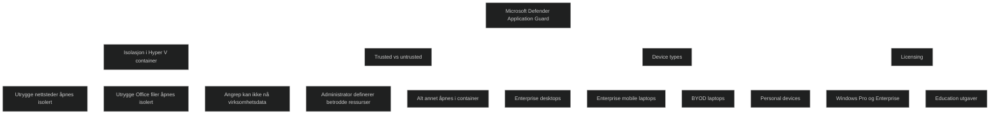

Microsoft Defender Application Guard isolerer utrygge nettsteder og utrygge Office filer i en egen Hyper V basert container. Målet er å hindre at skadelig kode får tilgang til systemet eller virksomhetsdata. Containeren er helt adskilt fra operativsystemet, slik at angrep ikke kan nå brukerens identitet, nettverk eller filer.

Application Guard er nå _avviklet_ for Microsoft Edge og fjernet fra Windows 11 versjon 24H2. Organisasjoner som fortsatt bruker løsningen anbefales å styre overgang til moderne alternativer som Microsoft Edge sikkerhetsfunksjoner, AppLocker eller Microsoft Edge management service.

## What is Application Guard and how does it work?

Application Guard isolerer alt som ikke er definert som betrodd. Administratorer definerer hvilke nettsteder, ressurser og nettverk som er betrodde. Alt annet åpnes i en Hyper V container.

- For Microsoft Edge: utrygge nettsteder åpnes i en isolert nettleserinstans.
- For Microsoft Office: utrygge dokumenter åpnes i en isolert Office instans.

Hvis innholdet viser seg å være skadelig, forblir angrepet inne i containeren og får ikke tilgang til virksomhetsdata eller brukerens identitet.

## What types of devices should use Application Guard?

Application Guard kan brukes på flere typer klienter:

- Enterprise desktops: domenejoinet, administrert via Intune eller Configuration Manager.
- Enterprise mobile laptops: domenejoinet, trådløs bruk, administrert via Intune eller Configuration Manager.
- BYOD mobile laptops: ikke domenejoinet, administrert via Intune.
- Personal devices: ikke administrert, brukeren er lokal administrator.

Dette viser at Application Guard kan brukes i både styrte og delvis styrte miljøer, men gir mest verdi i virksomhetsstyrte scenarioer.

## Windows edition and licensing requirements

Application Guard støttes i:

- Windows Pro
- Windows Enterprise
- Windows Pro Education og SE
- Windows Education

Lisensrettigheter gis gjennom Windows Pro, Enterprise E3 og E5, samt Education A3 og A5.

<a href="/certs/diagrams/application-guard.html" target="_blank" rel="noopener">Stort diagram</a>

[Microsoft Defender Application Guard](https://learn.microsoft.com/en-us/windows/security/application-security/application-isolation/microsoft-defender-application-guard/md-app-guard-overview)