Microsoft Defender Credential Guard beskytter autentiseringshemmeligheter ved å bruke virtualiseringsbasert sikkerhet. Funksjonen isolerer NTLM hasher, Kerberos Ticket Granting Tickets og andre legitimasjoner i et eget beskyttet miljø som bare klarerte systemkomponenter får tilgang til.

Dette hindrer angrep som pass the hash og pass the ticket, der angripere forsøker å hente ut legitimasjon fra minnet. Selv skadevare med administratorrettigheter får ikke tilgang til hemmelighetene når Credential Guard er aktivert.

# Platform security features to protect credentials

NTLM, Kerberos og Credential Manager bruker plattformfunksjoner som Secure Boot og virtualisering for å beskytte legitimasjon. Disse mekanismene sørger for at hemmeligheter bare lastes av klarerte komponenter og ikke kan manipuleres av ondsinnet kode.

# Virtualization‑based security

Credential Guard kjører autentiseringshemmeligheter i et isolert miljø som er adskilt fra operativsystemet.

- LSA i Windows kommuniserer med en isolert LSA prosess
- Hemmeligheter lagres i et beskyttet område utilgjengelig for resten av systemet
- Bare et begrenset sett signerte binærfiler får kjøre i det isolerte miljøet
- Drivere er blokkert for å hindre manipulering

Dette gir et sterkt vern mot angrep som forsøker å hente ut legitimasjon fra minnet.

# Better protection against advanced persistent threats

Credential Guard stopper teknikker som brukes i målrettede angrep. Selv om funksjonen gir sterk beskyttelse, kan avanserte trusselaktører forsøke nye metoder. Derfor anbefales det å kombinere Credential Guard med andre sikkerhetsfunksjoner som Device Guard og en helhetlig sikkerhetsarkitektur.

# Protokollbegrensninger

Når Credential Guard er aktivert:

- NTLMv1, MS CHAPv2, Digest og CredSSP kan ikke bruke påloggingsinformasjonen
- Kerberos blokkerer unconstrained delegation og DES
- Apper kan fortsatt be om sekundære legitimasjoner ved behov

Dette er viktig å kjenne til i miljøer med eldre systemer.

# Aktivering via Group Policy

Credential Guard kan aktiveres gjennom:

- Group Policy
    
    - Turn On Virtualization Based Security → Enabled
    - Velg Secure Boot eller Secure Boot and DMA Protection
    - Velg Credential Guard konfigurasjon med eller uten UEFI lock
- Intune
    - Enhetskonfigurasjon for Windows 10 og nyere

# MD‑102 relevans

- forklare hvordan Credential Guard beskytter NTLM, Kerberos og andre hemmeligheter
- forstå hvordan virtualiseringsbasert sikkerhet isolerer LSA
- kjenne til protokollbegrensninger når funksjonen er aktiv
- vite hvordan Credential Guard aktiveres via GPO og Intune
- se hvordan Credential Guard inngår i Zero Trust og plattformintegritet

```mermaid
%%{init: {
  "theme": "dark",
  "themeVariables": {
    "primaryColor": "#1e1e1e",
    "primaryTextColor": "#ffffff",
    "lineColor": "#ffffff",
    "secondaryColor": "#333333"
  }
}}%%

flowchart TB

    A[Windows Defender Credential Guard]

    A --> B[Beskyttede hemmeligheter]
    B --> B1[NTLM hasher]
    B --> B2[Kerberos TGT]
    B --> B3[App lagrede legitimasjoner]

    A --> C[Virtualiseringsbasert sikkerhet]
    C --> C1[Isolert LSA miljø]
    C --> C2[Klarerte systemkomponenter]
    C --> C3[Ingen tilgang fra OS prosesser]

    A --> D[Beskyttelse mot angrep]
    D --> D1[Stopper pass the hash]
    D --> D2[Stopper pass the ticket]
    D --> D3[Hindrer APT teknikker]

    A --> E[Plattformfunksjoner]
    E --> E1[Secure Boot]
    E --> E2[TPM]
    E --> E3[VBS]

    A --> F[Aktivering]
    F --> F1[Group Policy]
    F --> F2[Intune]

    A --> G[Anbefalinger]
    G --> G1[Kombiner med Device Guard]
    G --> G2[Del av Zero Trust]

```

<a href="/certs/diagrams/defender-credential-guard.html" target="_blank" rel="noopener">Stort diagram</a>