Device Guard er et sett med sikkerhetsfunksjoner i Windows som låser ned systemet slik at _kun klarert og signert kode får kjøre_. Det kombinerer _Application Control_ med _virtualiseringsbasert sikkerhet (VBS)_ og _hypervisor‑beskyttet kodeintegritet (HVCI)_ for å beskytte kjernen og kritiske prosesser mot injeksjon og manipulering.

Hovedmålet er å skape et _trusted execution environment_ der skadelig eller usignert kode ikke kan kjøre, selv om angriperen får høy privilegert tilgang. Dette gjør Device Guard til en av de mest robuste forsvarsmekanismene i Windows.

## Viktige punkter (eksamensrettet)

### Hva Device Guard gjør

- Sikrer at _kun signert og klarert kode_ får kjøre.
- Bruker _VBS_ for å isolere kodeintegritetstjenesten fra Windows kjernen.
- Bruker _HVCI_ for å hindre kjøring av usignert eller manipulert kode.
- Beskytter mot avanserte angrep som forsøker å injisere kode i kjernen.
- Gir _Trusted Boot_, som sikrer at systemet starter i en kjent og trygg tilstand.

### Hvordan det fungerer

- Kritiske prosesser kjøres i en _hypervisor‑beskyttet container_.
- Kodeintegritetspolicyer definerer hva som er tillatt.
- Usignerte apper, skript og drivere blokkeres.
- Krever maskinvare som støtter Secure Boot, SLAT og virtualisering.

### Hvorfor det er viktig i MD‑102

- Device Guard er en del av [Zero Trust](Zero-Trust.md) i Windows.
- Det bygger videre på [Application Control ](Microsoft-Defender-Application-Guard.md) og gir sterkere beskyttelse.
- Det er sentralt i moderne endepunktforsvar mot ukjent malware og zero‑day angrep.

```mermaid
%%{init: {
  "theme": "dark",
  "themeVariables": {
    "primaryColor": "#1e1e1e",
    "primaryTextColor": "#ffffff",
    "lineColor": "#ffffff",
    "secondaryColor": "#333333"
  }
}}%%

flowchart TB

    A[Device Guard]

    A --> B[Hovedprinsipp]
    B --> B1[Kun klarert og signert kode får kjøre]
    B --> B2[Blokkerer usignert og ukjent kode]

    A --> C[Kjernekomponenter]
    C --> C1[Application Control]
    C --> C2[VBS Virtualiseringsbasert sikkerhet]
    C --> C3[HVCI Hypervisor beskyttet kodeintegritet]

    A --> D[Beskyttelse]
    D --> D1[Isolasjon av kodeintegritetstjenesten]
    D --> D2[Hindrer kjernemodus injeksjon]
    D --> D3[Sikrer Trusted Boot]

    A --> E[Krav]
    E --> E1[Secure Boot]
    E --> E2[SLAT og virtualisering]
    E --> E3[Kompatible drivere]

    A --> F[Bruksverdi]
    F --> F1[Høy sikkerhet i Enterprise]
    F --> F2[Beskyttelse mot zero day angrep]
    F --> F3[Styrker Zero Trust]

```

<a href="/certs/diagrams/defender-device-guard.html" target="_blank" rel="noopener">Stort diagram</a>

https://www.thewindowsclub.com/device-guard-windows-10
