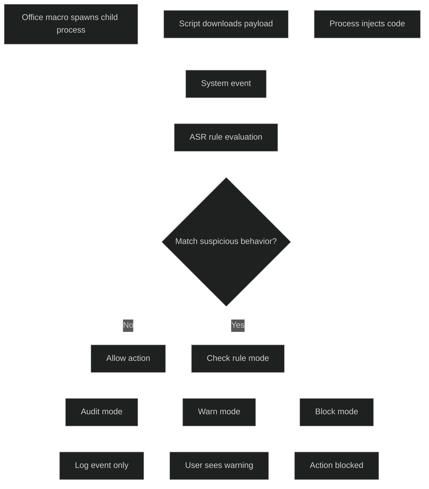

Windows Defender Exploit Guard er et sett med forebyggende sikkerhetsfunksjoner som reduserer angrepsflaten og stopper moderne trusler, inkludert minnebaserte angrep. Løsningen bygger på Microsoft Intelligent Security Graph og blokkerer skadelig atferd uavhengig av hvilken sårbarhet eller nyttelast som brukes. Dette gir et sterkt lag av beskyttelse før skade kan oppstå.

## Attack Surface Reduction (ASR): Intelligence to control the surface area of the device

Attack Surface Reduction (ASR) er en del av **Microsoft Defender Exploit Guard**, og beskytter Windows‑enheter ved å blokkere _atferd_ som ofte brukes i angrep – ikke bare kjente filer eller signaturer.

ASR stopper blant annet:

- ondsinnede Office‑makroer
- skript som prøver å laste ned eller kjøre skadevare
- prosesser som prøver å injisere kode
- forsøk på credential theft
- kjøring av mistenkelige eller ukjente apper

I motsetning til tradisjonell antivirus, som identifiserer kjente trusler, fokuserer ASR på **mønstre og handlinger** som er typiske for angrep. Dette gjør at ASR kan stoppe både kjente og ukjente (zero‑day) trusler.

ASR kan konfigureres i fire moduser:

- **Disabled** – av
- **Audit** – logger hva som ville blitt blokkert
- **Warn** – viser advarsel, bruker kan overstyre
- **Block** – blokkerer handlingen

ASR administreres vanligvis via **Intune**, **Group Policy**, **PowerShell** eller **Defender for Endpoint**.

<a href="/certs/diagrams/defender-exploit-guard-asr.html" target="_blank" rel="noopener">Stort diagram</a>
## Network protection: Blocking outbound connection

Network protection blokkerer utgående trafikk til ondsinnede domener og IP adresser basert på Microsofts trusselintelligens. Dette stopper phishing, sosial manipulering og kommunikasjon med kommandokontrollservere. Beskyttelsen gjelder for hele systemet, ikke bare nettleseren.

## Controlled folder access

Controlled folder access beskytter viktige mapper mot uautoriserte apper, inkludert ransomware. Bare godkjente apper får tilgang til beskyttede mapper. Forsøk på å endre filer blokkeres i sanntid og brukeren varsles. Dette hindrer tap av data ved krypteringsangrep.

## Exploit protection

Exploit protection erstatter EMET og gir innebygde mitigeringer mot sårbarhetsutnyttelse. Funksjonene er aktivert som standard og kan tilpasses per app. Dette gjør systemet mer motstandsdyktig mot angrep som forsøker å utnytte minnehåndtering eller kjente svakheter.

## Windows Defender Exploit Guard manageability

Alle komponenter kan administreres via gruppepolicy, Configuration Manager og Intune. Funksjonene støtter både Audit og Block. Audit gir innsikt i hva som ville blitt blokkert, mens Block stopper hendelser i sanntid. Varsler og hendelser vises i Windows Defender Advanced Threat Protection.

## Windows Defender Advanced Threat Protection

Windows Defender ATP gir en samlet visning av hendelser, prosesskjeder og blokkeringer. Dette gjør det enkelt å forstå hvordan et angrep utviklet seg og hvilke tiltak som ble iverksatt. Exploit Guard integreres i Security Analytics for å vise samsvar og anbefalinger.

```mermaid
%%{init: {
  "theme": "dark",
  "themeVariables": {
    "primaryColor": "#1e1e1e",
    "primaryTextColor": "#ffffff",
    "lineColor": "#ffffff",
    "secondaryColor": "#333333"
  }
}}%%

flowchart TB

    A[Windows Defender Exploit Guard]

    A --> B[Attack Surface Reduction]
    B --> B1[Blokkerer skadelig Office atferd]
    B --> B2[Stopper obfuskert skriptkode]
    B --> B3[Beskytter mot filfrie angrep]

    A --> C[Network protection]
    C --> C1[Blokkerer utgående trafikk til ondsinnede domener]
    C --> C2[Stopper phishing og C2 kommunikasjon]

    A --> D[Controlled folder access]
    D --> D1[Beskytter viktige mapper]
    D --> D2[Blokkerer uautoriserte apper i sanntid]

    A --> E[Exploit protection]
    E --> E1[Innebygde mitigeringer]
    E --> E2[Erstatter EMET]

    A --> F[Manageability]
    F --> F1[Støtte for GPO, SCCM og Intune]
    F --> F2[Audit og Block moduser]

    A --> G[Windows Defender ATP]
    G --> G1[Prosesskjeder og hendelser]
    G --> G2[Samsvar og anbefalinger]

```

<a href="/certs/diagrams/exploit-guard.html" target="_blank" rel="noopener">Stort diagram</a>

[Windows Defender Exploit Guard: Reduce the attack surface against next-generation malware | Microsoft Security Blog](https://www.microsoft.com/en-us/security/blog/2017/10/23/windows-defender-exploit-guard-reduce-the-attack-surface-against-next-generation-malware/?msockid=28996c4bc5706aa332647a05c44c6bd0)