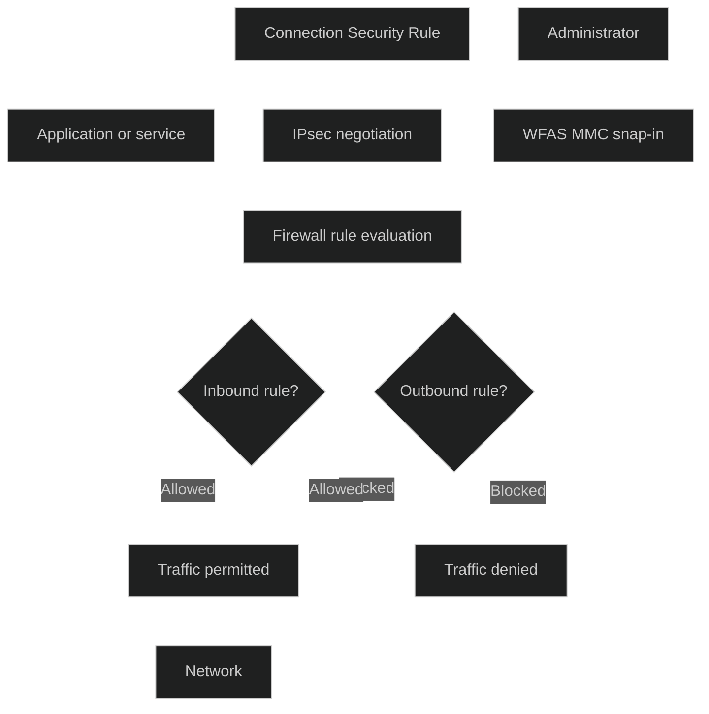

Windows Defender Firewall with Advanced Security (WFAS) er et MMC‑basert administrasjonsverktøy som gir **avansert kontroll over nettverkstrafikk**, både inn og ut. Det bygger på samme motor som den vanlige Windows‑brannmuren, men gir langt mer detaljert styring av regler, profiler og sikkerhetspolicyer.

WFAS brukes til å:

- konfigurere **inbound** og **outbound** regler for applikasjoner, porter, protokoller og tjenester
- definere **Connection Security Rules** som bruker IPsec for autentisering og kryptering mellom enheter
- administrere brannmurprofiler (Domain, Private, Public) og tilhørende policyer
- implementere brannmurkonfigurasjon via **Group Policy**, **MDM (CSP)** eller lokalt på en enhet
- overvåke aktiv trafikk og logge blokkert eller tillatt trafikk

WFAS er tilgjengelig via `wf.msc` og brukes i både klient og servermiljøer. Det er et sentralt verktøy i MD‑102 fordi det gir administratorer kontroll over hvordan enheter kommuniserer i nettverk, og hvordan man reduserer angrepsflaten ved å begrense unødvendig trafikk.

