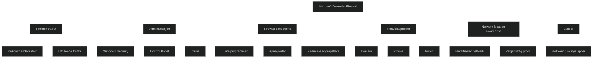

Microsoft Defender Firewall er en kjernekomponent i Windows sikkerhetsmodellen. Den kontrollerer all innkommende og utgående trafikk og sørger for at bare godkjente programmer og tjenester får kommunisere. Brannmuren fungerer som et filter mellom enheten og nettverket, og beskytter mot uautorisert tilgang, skadevare og forsøk på å utnytte åpne porter.

Brannmuren kan administreres fra Windows Security, Control Panel og Network and Sharing Center. I Control Panel kan du konfigurere grunnleggende innstillinger og se varsler. I Network and Sharing Center kan du endre nettverksprofil og tilpasse hvordan brannmuren oppfører seg på ulike nettverkstyper. I moderne miljøer administreres brannmuren ofte via Intune, der innstillingene ligger i Endpoint protection profiler. Dette gir sentral styring av regler, profiler og varsler.

# Firewall exceptions

Unntak brukes når programmer eller tjenester trenger å kommunisere gjennom brannmuren. Å tillate et program er tryggere enn å åpne en port, siden en port forblir åpen hele tiden, mens et program bare åpner kommunikasjon når det trengs. Hver åpning reduserer sikkerheten, og det anbefales derfor å:

- bare tillate programmer som er nødvendige
- fjerne unødvendige unntak
- aldri tillate programmer du ikke kjenner

Unntak administreres via Control Panel, der du kan legge til, endre eller fjerne programmer og porter. Dette er viktig for å redusere angrepsflaten og sikre at bare godkjente apper får nettverkstilgang.

# Multiple active firewall profiles

Windows støtter flere aktive profiler samtidig. Dette gjør at en enhet kan bruke domenets regler selv om den også er koblet til andre nettverk. Network location awareness identifiserer nettverk basert på IP og maskinvareadresser og velger riktig profil automatisk.

Profilene er:

- **Domain networks**: brukes når enheten kan nå en domenekontroller
- **Private networks**: brukes på nettverk du stoler på
- **Guest or public networks**: mest restriktiv, brukes på åpne nettverk

Hver profil kan ha egne regler, som å blokkere alle innkommende tilkoblinger eller vise varsler når programmer blokkeres. Dette gir fleksibilitet og sikrer at enheten alltid har riktig beskyttelsesnivå.

# Windows Defender Firewall notifications

Brannmuren kan vise varsler når nye programmer blokkeres. Dette styres i Control Panel under Change notification settings. Varsler kan aktiveres eller deaktiveres per nettverksprofil. Dette gir brukeren kontroll over hvilke programmer som får nettverkstilgang, og gjør det enklere å oppdage uventet aktivitet.

<a href="/certs/diagrams/defender-firewall.html" target="_blank" rel="noopener">Stort diagram</a>