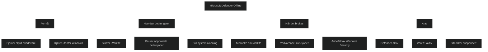

Microsoft Defender Offline er et skanneverktøy som kjører fra et eget, isolert miljø utenfor Windows. Det brukes når skadevare er så dypt integrert i systemet at den ikke kan fjernes mens Windows kjører. Dette gjelder særlig rootkits, MBR infeksjoner og annen vedvarende skadevare som forsøker å skjule seg før operativsystemet starter.

Verktøyet starter i Windows Recovery Environment og kjører en full skanning med oppdaterte definisjoner. Siden skanningen skjer utenfor Windows kjernen, kan den oppdage og fjerne trusler som ellers ville vært skjult. Dette gjør Microsoft Defender Offline til et viktig verktøy i situasjoner der vanlig skanning ikke er nok.

# Når Microsoft Defender Offline bør brukes

- Mistanke om rootkits eller annen skjult skadevare
- Vedvarende infeksjoner som kommer tilbake etter vanlig skanning
- Når Windows Security anbefaler det etter funn av alvorlige trusler
- Når du vil bekrefte at et system er helt rent etter et utbrudd

# Viktige krav

- Microsoft Defender Antivirus må være aktivt
- WinRE må være aktivert
- BitLocker bør suspenderes før skanningen for å unngå krav om gjenopprettingsnøkkel
- Administratorrettigheter kreves for å starte skanningen

# MD 102 relevans

- forklare hva Microsoft Defender Offline gjør og hvorfor det brukes
- forstå forskjellen mellom vanlig skanning og offline skanning
- kjenne til scenarier der offline skanning er nødvendig
- vite hvilke krav som må være oppfylt for at skanningen skal fungere
- se hvordan dette inngår i en helhetlig strategi for endepunktbeskyttelse

<a href="/certs/diagrams/defender-offline.html" target="_blank" rel="noopener">Stort diagram</a>