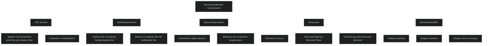

Microsoft Defender SmartScreen er en innebygd sikkerhetsfunksjon i Windows 10, Windows 11 og Microsoft Edge. Den beskytter brukere ved å analysere nettsteder, nedlastinger og apper i sanntid. SmartScreen sammenligner URLer og filer med Microsofts dynamiske lister over rapporterte phishing sider, malware sider og farlige programmer. Dersom noe virker mistenkelig eller mangler etablert omdømme, vises en advarsel.

Viktige egenskaper:

- _Anti phishing_: Blokkerer nettsteder som forsøker å stjele brukerinformasjon.
- _Anti malware_: Stopper nettsteder og filer som distribuerer skadelig programvare.
- _Reputasjonsbasert filkontroll_: Varsler når en fil ikke er kjent eller mangler digital signatur.
- _Atferdsanalyse av nettsteder_: Oppdager mistenkelig kode og aktivitet.
- _Integrert i Windows, Edge, Microsoft Store og Outlook_.

For MD 102 er SmartScreen viktig fordi det er en del av _Attack Surface Reduction_ og gir et tidlig forsvar mot sosial manipulasjon, drive by angrep og farlige nedlastinger.

<a href="/certs/diagrams/defender-smartscreen.html" target="_blank" rel="noopener">Stort diagram</a>

[Microsoft Defender SmartScreen overview | Microsoft Learn](https://learn.microsoft.com/en-us/windows/security/operating-system-security/virus-and-threat-protection/microsoft-defender-smartscreen/?utm_source=copilot.com)