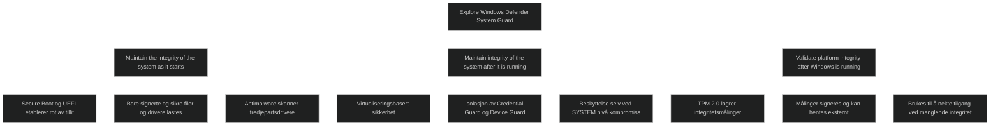

Windows Defender System Guard beskytter systemintegriteten gjennom hele livssyklusen. Løsningen isolerer kritiske tjenester i en egen sikker beholder og sørger for at systemet ikke kan manipuleres av angripere, selv om de får høy privilegert tilgang. System Guard samler flere integritetsfunksjoner i en helhetlig modell som styrker plattformens motstandskraft.

## Maintain the integrity of the system as it starts

System Guard bygger på en maskinvarebasert rot av tillit gjennom Secure Boot og UEFI. Dette hindrer at uautoriserte komponenter som bootkits og rootkits kan starte før Windows. Bare signerte og sikre Windows filer og drivere lastes inn. Når oppstarten er fullført, aktiveres antimalwareløsningen for å skanne tredjepartsdrivere. Dette sikrer at systemet starter i en tilstand med høy integritet.

## Maintain integrity of the system after it is running (run time)

System Guard bruker virtualiseringsbasert sikkerhet til å isolere kritiske tjenester som Credential Guard, Device Guard, Virtual TPM og deler av Exploit Guard. Disse tjenestene ligger i et maskinvareisolert miljø som ikke kan manipuleres selv om angriperen får SYSTEM nivå eller kompromitterer kjernen. Dette gir et robust forsvar mot avanserte angrep.

## Validate platform integrity after Windows is running (run time)

System Guard tar integritetsmålinger under oppstart og lagrer dem i TPM 2.0 i et maskinvareisolert område. Målingene signeres og kan hentes av administrasjonsverktøy som Intune eller Configuration Manager for ekstern validering. Dersom integriteten ikke kan bekreftes, kan tilgang til ressurser nektes. Dette bygger på et assume breach prinsipp og gir en viktig kontrollmekanisme i moderne sikkerhetsarkitektur.

<a href="/certs/diagrams/system-guard.html" target="_blank" rel="noopener">Stort diagram</a>

[Explore Windows Defender System Guard ](https://learn.microsoft.com/en-us/training/modules/manage-microsoft-defender-endpoint/7-explore-windows-defender-system-guard)