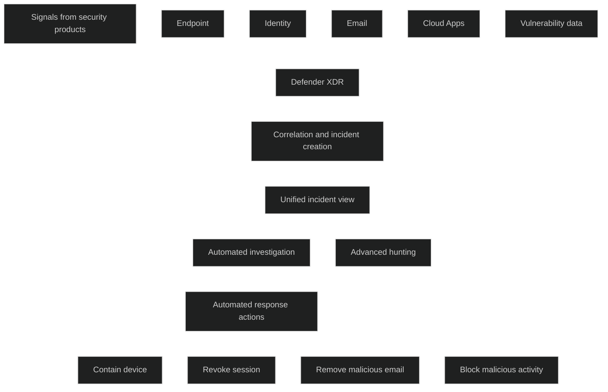

Microsoft Defender XDR er en _samlet sikkerhetsplattform_ som koordinerer forebygging, deteksjon, etterforskning og respons på tvers av endepunkter, identiteter, epost, apper og skyressurser. Løsningen samler signaler fra flere Microsoft sikkerhetsprodukter og setter dem sammen til _en helhetlig trusselmodell_, slik at sikkerhetsteam kan se hele angrepskjeden og handle raskere.

Defender XDR bruker data fra blant annet:

- Defender for Endpoint
- Defender for Office 365
- Defender for Identity
- Defender for Cloud Apps
- Defender Vulnerability Management
- Microsoft Entra ID Protection
- Microsoft Defender for Cloud

Kjernen i løsningen er at den _knytter sammen signaler_ fra disse produktene, grupperer relaterte varsler til ett samlet hendelsesforløp og utfører _automatiserte tiltak_ som å isolere enheter, stoppe prosesser, fjerne skadevare, sperre brukersesjoner eller rydde epost.

Defender XDR gir også avansert søk med KQL, automatisk angrepsforstyrrelse og integrert respons på tvers av hele miljøet. Dette gjør det mulig å stoppe angrep før de sprer seg og gjenopprette berørte ressurser automatisk.

<a href="/certs/diagrams/defender-xdr.html" target="_blank" rel="noopener">Stort diagram</a>

[What is Microsoft Defender XDR? - Microsoft Defender XDR | Microsoft Learn](https://learn.microsoft.com/en-us/defender-xdr/microsoft-365-defender)
