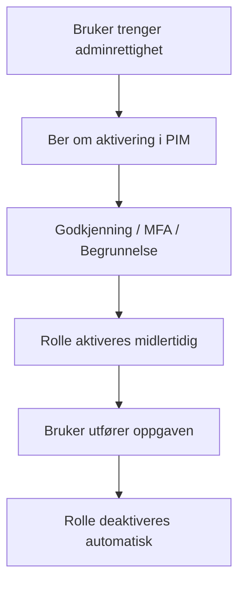

Microsoft Entra Privileged Identity Management (PIM) er en sikkerhetsfunksjon som lar organisasjoner overvåke og begrense tilgang til privilegerte roller og ressurser i Entra ID og Microsoft 365.

PIM sørger for at adminrettigheter kun gis når de trengs, og kun så lenge de trengs. Dette reduserer risikoen for misbruk, feil og angrep.

PIM gir blant annet disse fordelene:

| Just-In-Time (JIT) tilgang             | Brukere får ikke permanente adminrettigheter, de må aktivere rollen når de trenger den                                          |
| -------------------------------------- | ------------------------------------------------------------------------------------------------------------------------------- |
| Godkjenning før aktivering             | Kan kreve at en admin må få godkjenning av en annen admin før tilgang gis. Dette gir kontroll og sporbarhet                     |
| Logging og overvåkning                 | Registrerer hvem som aktiverte rollen når, lengde og hva de gjorde. Dette gir sporbarhet og bedre sikkerhetsovervåkning         |
| Varsler og risikobasert overvåkning    | Kan sende varsler ved uvanlig rollebruk, for mange permanente adminer og risikooppdagelser for å at du skal kunne reagere raskt |
| Redusere antall permanente adminroller | Fjerne permanente globale adminer og andre roller som ikke trenger kontinuerlig tilgang. En del av Zero Trust prinsippene       |
| MFA krav                               | Kan kreve MFA og policyer ved aktivering for å sikre at kun legitime brukere får tilgang                                        |

