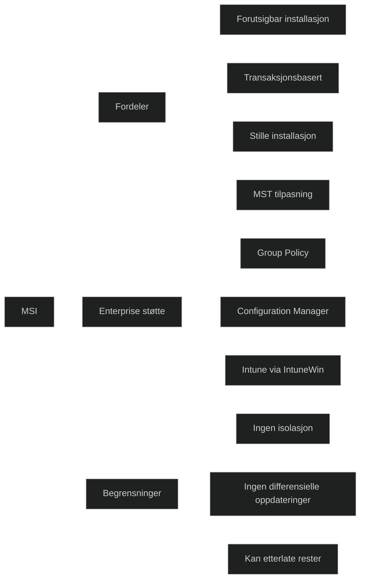

_MSI (Microsoft Installer)_ er Microsofts klassiske installasjonsformat for Windows‑programmer. Det brukes i mange eldre og moderne applikasjoner, og er fortsatt viktig i enterprise‑miljøer. MSI er strukturert som en database med tabeller som definerer installasjonslogikk, filer, registre, tjenester og avhengigheter.

For MD‑102 er det viktig å forstå at MSI:

- er _det eneste formatet_ som Group Policy kan distribuere
- støttes fullt ut av Configuration Manager
- kan brukes i Intune, men kun som _Win32‑app pakket som IntuneWin_
- gir _forutsigbar installasjon og avinstallasjon_
- støtter _silent install_ og _standardiserte parametere_
    

MSI er stabilt og forutsigbart, men mangler moderne funksjoner som containerisolasjon og differensielle oppdateringer som finnes i MSIX.

### Viktige egenskaper (MD‑102 relevant)

- _Transaksjonsbasert installasjon_ Installerer alt eller ruller tilbake ved feil.
- _Standardisert struktur_ Tabeller definerer filer, registre, tjenester og handlinger.
- _Støtte for transformfiler (MST)_ Brukes til å tilpasse installasjonen i enterprise‑miljøer.
- _Støtte for stille installasjon_ Viktig for automatisert distribusjon.
- _Full støtte i Configuration Manager_ MSI er det mest stabile formatet for SCCM‑miljøer.
- _Kan distribueres via Intune_ Men må pakkes som IntuneWin.

### Begrensninger

- Ingen containerisolasjon
- Ingen differensielle oppdateringer
- Kan etterlate spor i systemet ved feil
- Ikke egnet for moderne app‑sandboxing
- Krever ofte MST for tilpasning

