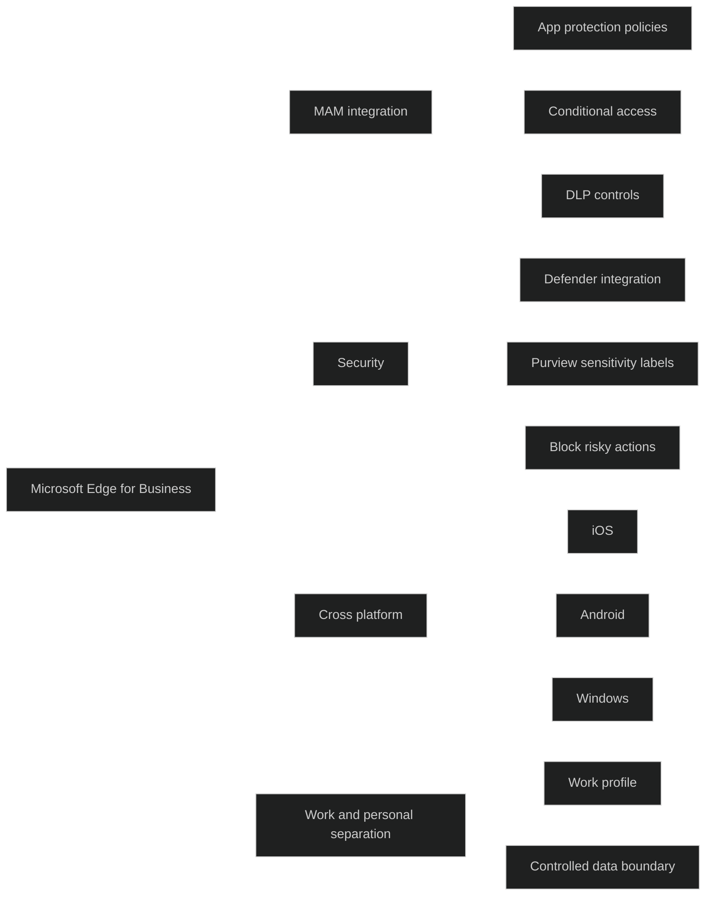

Intune Managed Browser var tidligere Microsofts egen sikre nettleser for Mobile Application Management. Den er nå erstattet av _Microsoft Edge for Business_, som fungerer som den moderne, MAM‑integrerte nettleseren i Intune.

Edge for Business gir en kontrollert nettleseropplevelse der organisasjoner kan håndheve appbeskyttelsespolicyer, databeskyttelse og conditional access på både administrerte og ikke administrerte enheter. Dette gjør at brukere kan få sikker tilgang til bedriftsressurser uten at hele enheten må administreres.

Edge for Business støtter:

- appbeskyttelsespolicyer på Android, iOS og Windows
- databeskyttelse gjennom DLP, blokkering av kopiering og liming, og kontroll av nedlasting av sensitive filer
- separasjon av jobb og privat bruk gjennom arbeidsprofiler og identitetsstyring
- integrasjon med Microsoft Entra, Intune og Defender for Endpoint for helhetlig sikkerhet

Edge for Business er den anbefalte nettleseren for MAM‑scenarier, og erstatter den tidligere Intune Managed Browser.

[Secure Your Corporate Data in Intune with Microsoft Edge for Business - Microsoft Intune | Microsoft Learn](https://learn.microsoft.com/en-za/intune/solutions/edge-data-security/overview)
[Enterprise Browser with Built-In Security | Microsoft Edge for Business](https://www.microsoft.com/en-us/edge/business/security)
[Deploying Edge for Business Using Intune in Enterprise](https://www.linkedin.com/pulse/deploying-edge-business-using-intune-enterprise-devraj-mukherjee-wfk3c)
