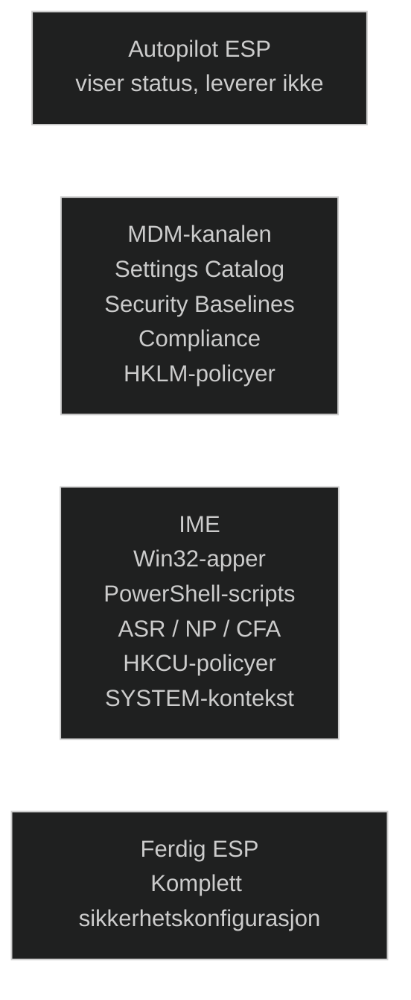

Intune Management Extension (IME) er en viktig del av Intune som utvider hva tjenesten kan administrere på Windows 10/11‑enheter. Den gjør det mulig for administratorer å håndtere flere scenarier enn det tradisjonell MDM støtter, blant annet:
- distribuere Win32‑applikasjoner
- kjøre PowerShell‑skript
- konfigurere mer avanserte eller komplekse innstillinger

IME fungerer som et bindeledd mellom Intune og Windows, og gir tilgang til områder av systemet som MDM‑protokoller ikke kan styre direkte. Dette gjør den spesielt nyttig i virksomheter som trenger fleksibilitet og mer detaljert kontroll over Windows‑enheter.

IME er kritisk for ESP fordi…
- ESP har ingen egen leveringsmotor
- IME leverer alt MDM ikke kan levere
- IME leverer Win32‑apper, scripts, ASR, NP, CFA
- IME leverer HKCU‑policyer som ESP venter på
- IME er nødvendig for å fullføre flere ESP‑steg
- IME fortsetter leveransen etter ESP
- Uten IME → ESP stopper, policyer mangler, apper mangler, sikkerhet mangler

Dette er grunnen til at Microsoft sier:

> “IME is required for full Autopilot functionality.”

Arbeidet med Autopilot og Exploit Guard har gjort det tydelig hvor sentral IME er for hele oppstartsopplevelsen. ESP viser bare status; den leverer ingenting selv. Det er IME som faktisk installerer Win32‑apper, kjører PowerShell‑scripts, håndterer HKCU‑innstillinger og fullfører de konfigurasjonene som MDM‑kanalen ikke kan levere. Når IME mangler, stopper ESP på apper, sikkerhetspolicyer og brukeroppsett, og klienten ender i en halvkonfigurert tilstand. Når IME er til stede, faller alt på plass: ASR, Network Protection, CFA, språk/region, og alle de komponentene som krever SYSTEM‑kontekst eller bruker‑kontekst. Dette har gitt en klar forståelse av hvorfor IME er en basis‑komponent i moderne Autopilot‑miljøer, og hvorfor en stabil og forutsigbar klientopplevelse er avhengig av at IME fungerer fra første sekund.

[Understand Microsoft Intune Management Extension - Microsoft Intune](https://learn.microsoft.com/en-us/intune/intune-service/apps/intune-management-extension)