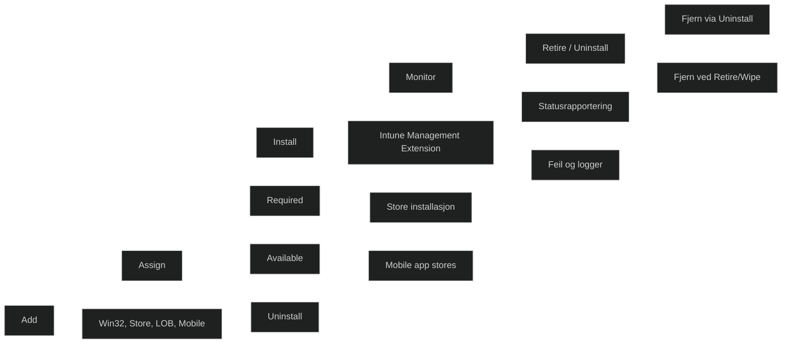

Microsoft Intune app lifecycle beskriver hele prosessen en app går gjennom fra den legges til i Intune til den fjernes fra enheten. Dette er grunnleggende MD‑102‑kunnskap fordi det viser hvordan Intune håndterer distribusjon, installasjon, oppdatering, overvåking og avinstallasjon av apper.

Livssyklusen består av fem hovedfaser:

1. _Add_ – appen legges til i Intune
2. _Assign_ – appen tilordnes brukere eller enheter
3. _Install_ – appen installeres via Intune eller IME
4. _Monitor_ – administrator overvåker status og feil
5. _Retire / Uninstall_ – appen fjernes eller avinstalleres

Dette gjelder for alle appkategorier: Win32, Store, LOB, mobile apper og webapplikasjoner.

### Viktige punkter 

#### Add

- Appen lastes opp eller velges fra Microsoft Store
- Metadata fylles inn automatisk for Store‑apper
- Win32‑apper må pakkes som .intunewin

#### Assign

- Required: installeres automatisk
- Available: brukeren installerer via Company Portal
- Uninstall: fjernes hvis tidligere installert av Intune
- Støtter include og exclude grupper

#### Install

- Win32‑apper installeres via Intune Management Extension
- Store‑apper installeres via Microsoft Store tjenesten
- Mobile apper installeres via Apple/Google infrastruktur

#### Monitor

- Intune rapporterer installasjonsstatus
- Feil vises i admin center
- Win32‑apper gir detaljerte IME‑logger

#### Retire / Uninstall

- Required + Uninstall fjerner appen
- Available apper fjernes ikke automatisk
- iOS og Android kan fjernes ved device retire eller wipe

### Hvorfor dette er viktig

- Viser hvordan Intune faktisk håndterer apper i praksis
- Forklarer forskjellen mellom Required og Available
- Viser hvordan IME fungerer i Win32‑installasjoner
- Viser hvordan Intune overvåker og rapporterer status
- Viser hvordan apper fjernes på en kontrollert måte

<a href="/certs/diagrams/deploy-intune-life.html" target="_blank" rel="noopener">Stort diagram</a>
