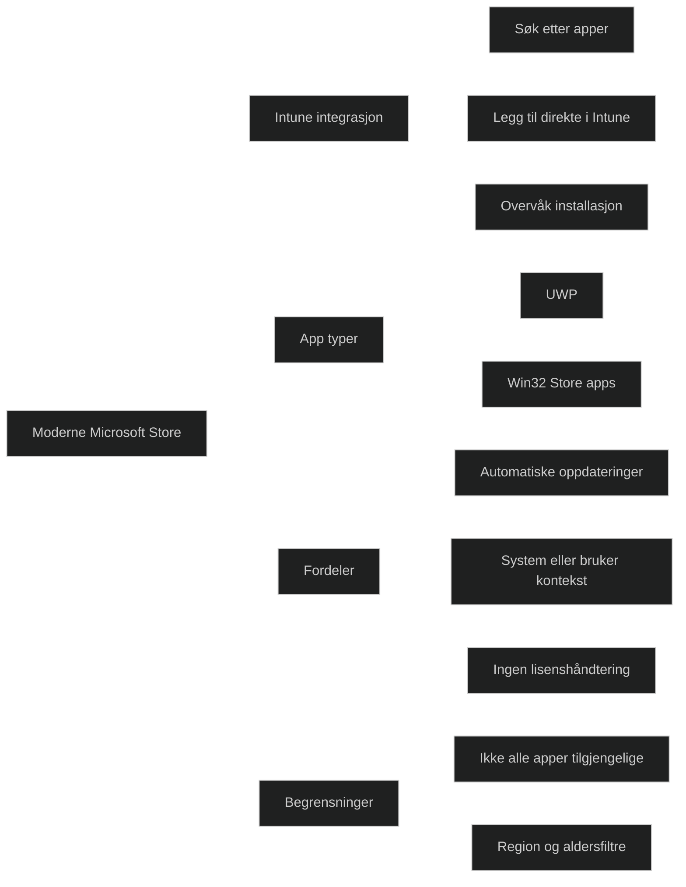

Den moderne _Microsoft Store‑integrasjonen i Intune_ er Microsofts nye måte å distribuere og administrere apper på i Windows‑miljøer. Den erstatter fullstendig den utgåtte Microsoft Store for Business og gir en strømlinjeformet, sentralisert og mer pålitelig appdistribusjon.

Integrasjonen gjør det mulig å:

- søke etter apper direkte i Intune
- distribuere både _UWP_ og _Win32 Store‑apper_
- overvåke installasjonsstatus
- bruke system eller bruker kontekst
- få automatiske oppdateringer uten manuell håndtering

Dette er nå _standardmetoden_ for å distribuere Microsoft Store‑apper i moderne administrasjon, og derfor svært relevant for MD‑102.

### Viktige egenskaper (MD‑102 relevant)

- _Direkte søk i Intune_ Administratorer finner og legger til apper uten å forlate Intune.
- _Støtte for Win32 Store‑apper_ Disse leveres via Microsoft Store, men installeres som tradisjonelle Win32‑programmer.
- _Automatiske oppdateringer_ Intune og Store håndterer oppdateringer uten behov for manuelle prosesser.
- _Støtte for system og bruker kontekst_ Viktig for apper som må installeres før brukeren logger inn.
- _Ingen lisenshåndtering_ Den gamle modellen med Online og Offline lisenser er fjernet.
- _Mer stabil distribusjon_ Store‑apper er mindre utsatt for feil enn tradisjonelle EXE‑installasjoner.

### Begrensninger

- Enkelte apper er ikke tilgjengelige i Store (for eksempel komplekse Win32‑apper)
- Region og aldersbegrensninger kan påvirke synlighet
- Android og iOS apper distribueres ikke via Store, men via egne kanaler

<a href="/certs/diagrams/deploy-app-store.html" target="_blank" rel="noopener">Stort diagram</a>
