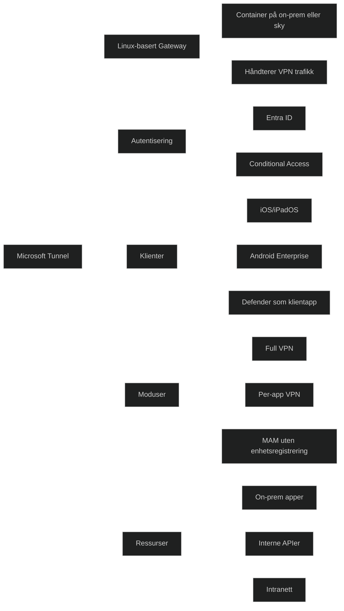

Microsoft Tunnel er en _VPN gateway‑løsning for Microsoft Intune_ som gir _sikker tilgang til interne ressurser_ fra _iOS/iPadOS og Android Enterprise‑enheter_. Tunnel kjører i en _Linux‑basert container_ og bruker _moderne autentisering og Conditional Access_ for å sikre at bare godkjente brukere og enheter får tilgang.

Tunnel kan brukes på to måter:

### Full Tunnel for Intune‑registrerte enheter

Gir enheten full eller per‑app VPN‑tilgang til interne ressurser. Krever Intune‑registrering og Microsoft Defender som klientapp.

### Tunnel for Mobile Application Management (MAM)

Gir _per‑app VPN_ til interne ressurser _uten at enheten må registreres i Intune_. Ideelt for BYOD‑scenarioer.

# Viktige funksjoner

- _Per‑app VPN_: Kun godkjente apper får tilgang til interne ressurser.
- _Conditional Access_: Tilgang styres basert på bruker, app, risiko og samsvar.
- _Moderne autentisering via Entra ID_: Identitet er kontrollplanet.
- _Støtte for både registrerte og uregistrerte enheter_ (via MAM).
- _Linux‑basert gateway_: Kan kjøre on‑prem eller i skyen.
- _Split tunneling og always‑on VPN_ tilgjengelig.
    

### MD‑102

Microsoft Tunnel er relevant fordi det:

- muliggjør _sikker tilgang til interne ressurser_ i moderne hybridmiljøer
- støtter _Zero Trust_ gjennom identitetsbasert tilgang og per‑app kontroll
- gir fleksibilitet for _BYOD_ uten å kreve full administrasjon
- integreres tett med _Intune policyer, Conditional Access og Defender_

