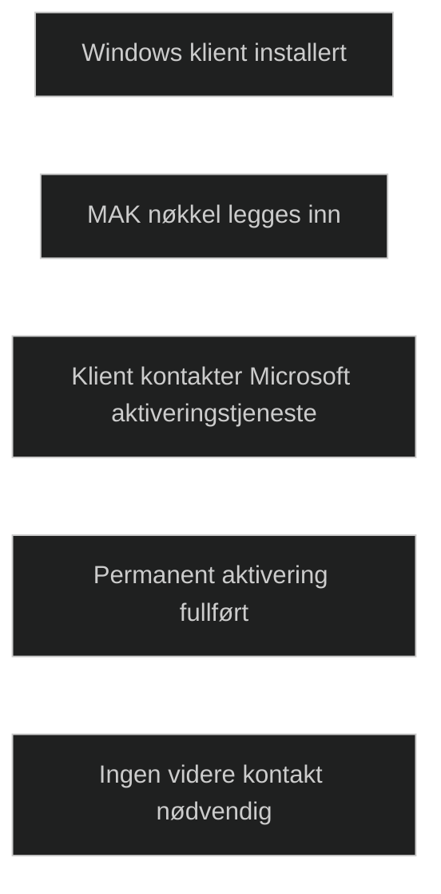

MAK, Multiple Activation Key, er en volumaktiveringsmetode der hver Windows klient aktiveres _en gang_ direkte mot Microsoft sine aktiveringstjenester. Når en klient er aktivert, trenger den ikke å kontakte Microsoft igjen, og aktiveringen er permanent for den installasjonen.

MAK brukes ofte i miljøer der klienter _ikke_ er regelmessig tilkoblet organisasjonens nettverk, som feltarbeid, isolerte nettverk eller maskiner som sjelden er online.

MAK kan brukes på to måter:

- _MAK Independent Activation_: hver klient aktiverer seg direkte mot Microsoft.
- _MAK Proxy Activation_: aktivering skjer via VAMT (Volume Activation Management Tool), som samler aktiveringsforespørsler og sender dem samlet.

MAK er en av de tre hovedmetodene for volumaktivering sammen med KMS og Active Directory basert aktivering. I MD 102 er det viktig å forstå at MAK er best egnet for _permanente, engangsaktiveringer_ og for klienter som ikke kan kontakte en KMS server.

