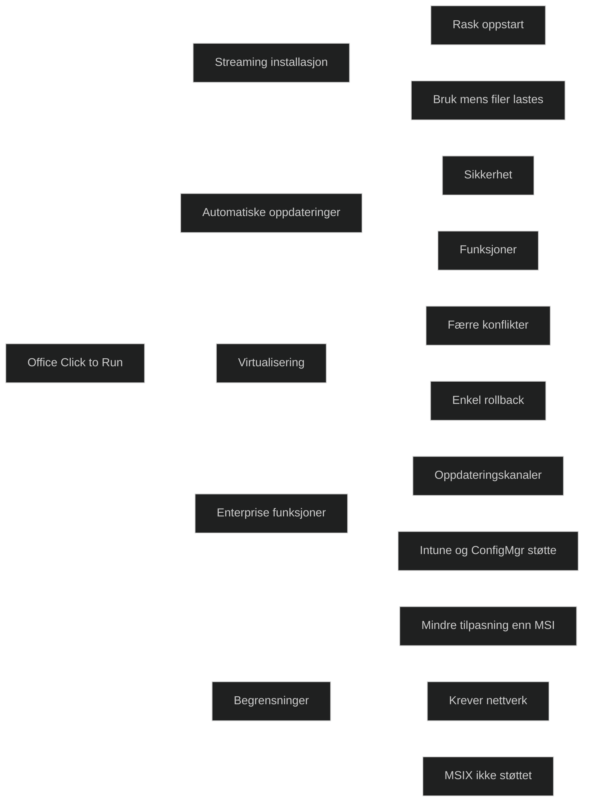

_Office Click to Run (C2R)_ er Microsofts moderne teknologi for distribusjon og oppdatering av Office. Den erstatter MSI i alle moderne Microsoft 365 miljøer og er den eneste anbefalte metoden for nye installasjoner. C2R bruker _streaming og virtualisering_, slik at Office kan tas i bruk før hele pakken er lastet ned.

For MD 102 er det viktig å forstå at _C2R er standarden_, at _MSI kun brukes for eldre volumlisensierte versjoner_, og at _MSIX ikke blir brukt for Office_ (Microsoft har avsluttet forsøket på MSIX for Office) .

### Viktige egenskaper (MD‑102 relevant)

- _Streaming installasjon_: Office kan brukes mens resten lastes ned
- _Automatiske oppdateringer_: sikkerhetsoppdateringer og funksjoner leveres fortløpende uten manuell innsats
- _Virtualisert miljø_: færre konflikter med andre apper og enklere rollback ved feil
- _Standard for Microsoft 365_: alle moderne Office‑versjoner leveres som C2R som standard
- _Mindre diskbruk og raskere installasjon_ enn MSI
- _Støtter oppdateringskanaler_ (Monthly, Semi Annual) som kan styres av IT (viktig i enterprise)

### Begrensninger

- _Mindre granularitet i tilpasning_ enn MSI (for eksempel valg av enkeltkomponenter)
- _Krever internettilgang_ for streaming og oppdateringer
- _Kan ikke brukes for eldre volumlisensierte Office‑versjoner_
- _MSIX er ikke et alternativ for Office_ på grunn av tekniske begrensninger i add ins, COM og integrasjoner

### Hvorfor C2R er viktig i MD‑102

- Det er _den eneste moderne og støttede måten_ å distribuere Office på
- Intune og Configuration Manager _forventer C2R_
- Oppdateringskanaler og automatiske oppdateringer er sentrale i sikkerhetsstyring
- MSI og MSIX er _irrelevante for moderne Office‑distribusjon_

<a href="/certs/diagrams/deploy-app-c2r.html" target="_blank" rel="noopener">Stort diagram</a>

[Unlocking the Power of Click-to-Run: Understanding the Modern Version of Office](https://thetechylife.com/what-is-a-click-to-run-version-of-office)
[Know about the MSI installer and a Click-to-Run Installation for Microsoft Office. How could I detect each one? – CSP/MSP 24 x 7 Support](https://connectioncloudsupport.zendesk.com/hc/en-us/articles/360042568814-Know-about-the-MSI-installer-and-a-Click-to-Run-Installation-for-Microsoft-Office-How-could-I-detect-each-one)
[What Is Microsoft Office Click-to-Run? - AEANET](https://www.aeanet.org/what-is-microsoft-office-click-to-run)
[MSIX Installer for Office: Microsoft giving up on the idea?](https://www.advancedinstaller.com/msix-installer-for-office-discontinued.html)
