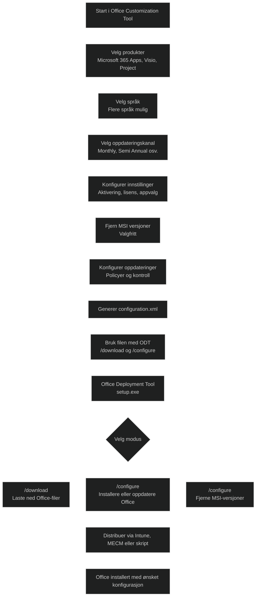

_Office Customization Tool (OCT)_ er et nettbasert verktøy som brukes til å _lage og tilpasse configuration.xml‑filer_ for [Office Deployment Tool (ODT)](Office-Deployment-Tool.md) . Det gir administratorer en grafisk måte å konfigurere Office‑installasjoner uten å skrive XML manuelt.

OCT brukes til å definere:

- hvilke Office‑produkter som skal installeres
- hvilke språk som skal inkluderes
- oppdateringskanal (Monthly, Semi Annual osv.)
- lisensiering og aktivering
- fjerning av eldre MSI‑baserte Office‑versjoner
- appinnstillinger og policyer
- installasjonsopplevelse (for eksempel stille installasjon)

Når konfigurasjonen er ferdig, genererer OCT en _configuration.xml_ som brukes av ODT til å laste ned og installere Office.

Dette gjør OCT ideelt for:

- Intune distribusjoner
- Configuration Manager
- manuelle installasjonsskript
- miljøer som trenger konsistent Office‑konfigurasjon

