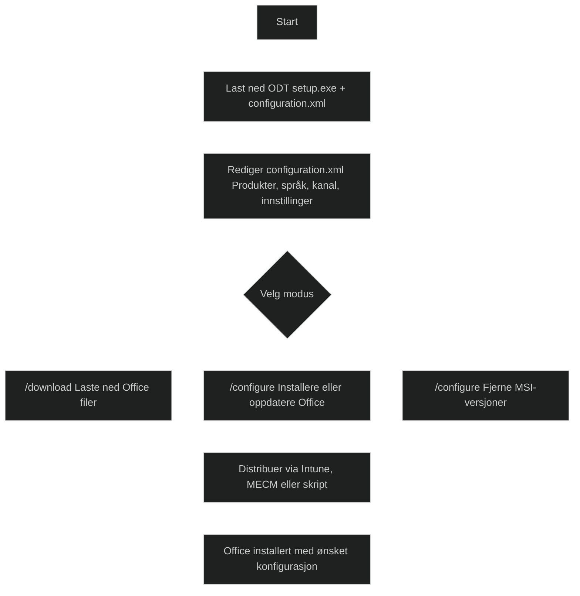

_Office Deployment Tool (ODT)_ er et kommandolinjeverktøy som brukes til å _laste ned, konfigurere og distribuere Microsoft 365 Apps og Office LTSC_ i virksomheter. Det gir administratorer _full kontroll_ over hvilke produkter, språk, oppdateringskanaler og innstillinger som installeres.

ODT består av to filer:

- _setup.exe_ – selve installasjonsmotoren
- _configuration.xml_ – definerer hva som skal installeres, hvordan og fra hvor

Administrator redigerer XML‑filen og kjører ODT i en av tre moduser:

- _/download_ – laster ned Office‑filer
- _/configure_ – installerer, oppdaterer eller fjerner Office
- _/packager_ – lager App‑V pakker (eldre bruk)

ODT brukes når man trenger:

- spesifikke apper (for eksempel bare Word og Excel)
- bestemte språk
- kontroll over oppdateringskanal (Monthly, Semi‑Annual osv.)
- fjerning av eldre MSI‑baserte Office‑versjoner
- distribusjon via Intune, Configuration Manager eller skript

ODT anbefales i større miljøer eller der Office må tilpasses før installasjon.

[Overview of the Office Deployment Tool - Microsoft 365 Apps | Microsoft Learn](https://learn.microsoft.com/en-us/microsoft-365-apps/deploy/overview-office-deployment-tool)
[Overview of the Office Deployment Tool](https://knowledge-base.acsupport.cloud/en/knowledge/overview-of-the-office-deployment-tool)
[A Comprehensive Guide on the Office Deployment Tool (ODT) and Office LTSC (Long Term Servicing Channel) 2024 - Theboringmagazine](https://theboringmagazine.com/a-comprehensive-guide-on-the-office-deployment-tool-odt-and-office-ltsc-long-term-servicing-channel-2024)
