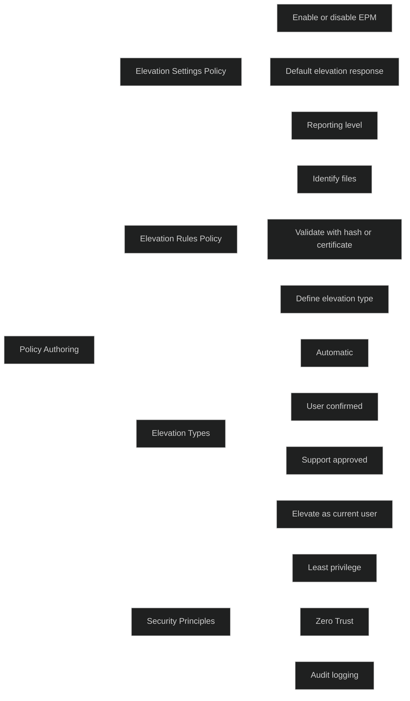

Policy Authoring i Endpoint Privilege Management handler om å _utforme og konfigurere EPM‑policyer_ som styrer hvordan og når brukere kan kjøre filer med forhøyede rettigheter. Dette gjøres gjennom to hovedtyper policyer:

### Elevation Settings Policy

Styrer hvordan EPM fungerer på enheten, inkludert:

- om EPM er aktivert
- standard oppførsel for filer uten regler
- rapporteringsnivå
- hva som skjer når en fil ikke matcher en regel

Microsoft Learn beskriver dette slik:

- Elevation settings policy brukes til å _«Enable or disable EPM on a device»_ og _«Set a default response for an elevation request of any file that isn't managed by a Windows elevation rule policy»_ .

### Elevation Rules Policy

Definerer _hvilke filer som kan kjøres med forhøyede rettigheter_, og _hvordan_ de skal valideres. Regler kan identifisere filer basert på:

- filnavn
- hash
- sertifikat
- metadata (produktnavn, intern navn, versjon osv.)

Microsoft Learn sier:

- _«An elevation rules policy is used to manage the identification of specific files, and how elevation requests for those files are handled.»_
- Støttede filtyper: _.exe_, _.msi_, _.ps1_ .

### Elevation types

Regler kan bruke ulike elevation‑typer, blant annet:

- _Automatic_
- _User confirmed_
- _Support approved_
- _Elevate as current user_

### Viktige prinsipper i Policy Authoring

- Least privilege
- Zero Trust
- Granulær kontroll over hvilke filer som kan kjøres
- Sporbarhet og logging
- Mulighet for support‑godkjenning ved behov

# MD‑102

Policy Authoring er kjernen i EPM og viser hvordan Intune:

- reduserer behovet for lokale administratorer
- gir kontrollert og sporbar elevasjon
- bruker identitet og policyer for å sikre enheter
- støtter Zero Trust gjennom minst mulig privilegier

[Managing Elevation Settings for Endpoint Privilege Management - Microsoft Intune | Microsoft Learn](https://learn.microsoft.com/en-us/intune/epm/manage-elevation-settings)
[Creating elevation rules with Endpoint Privilege Management - Microsoft Intune | Microsoft Learn](https://learn.microsoft.com/en-us/intune/epm/create-elevation-rules)
