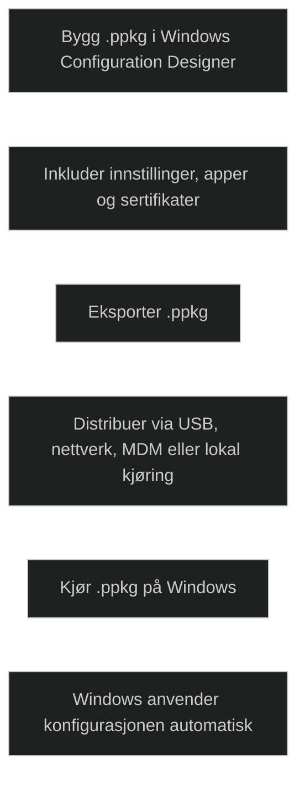

En provisioning package (_.ppkg_) er en container som inneholder konfigurasjonsinnstillinger for Windows. Den bygges i _Windows Configuration Designer_, som gjør det mulig å samle innstillinger, apper, sertifikater, nettverksoppsett og andre tilpasninger i én fil. Dette gir en rask måte å konfigurere Windows uten reinstallasjon eller imaging.

En .ppkg kan brukes under første oppstart eller på en eksisterende installasjon. En provisioning package kan distribueres via USB, nettverk, MDM eller kjøres lokalt på en eksisterende Windows installasjon. Når filen kjøres, leser Windows innstillingene og anvender dem automatisk. Dette gjør metoden nyttig i miljøer med begrenset nettverkstilgang, små organisasjoner eller situasjoner der man trenger rask lokal konfigurasjon.

En .ppkg består av tre hoveddeler: _metadata_, _XML‑beskrivelser_ av innstillinger og _payloads_ som inneholder faktiske data som apper eller sertifikater. Flere .ppkg‑filer kan kombineres, og Windows bruker en prioritetsmodell basert på eiertype og rangering for å avgjøre hvilke innstillinger som vinner ved konflikt.

Provisioning packages brukes ofte til:

- rask utrulling av nye Windows‑klienter
- bulk‑konfigurasjon i organisasjoner
- offline‑oppsett
- automatisering av standardiserte Windows‑miljøer

Dette gjør .ppkg til et viktig verktøy i MD‑102 når du skal forstå alternativer til Autopilot og imaging.

