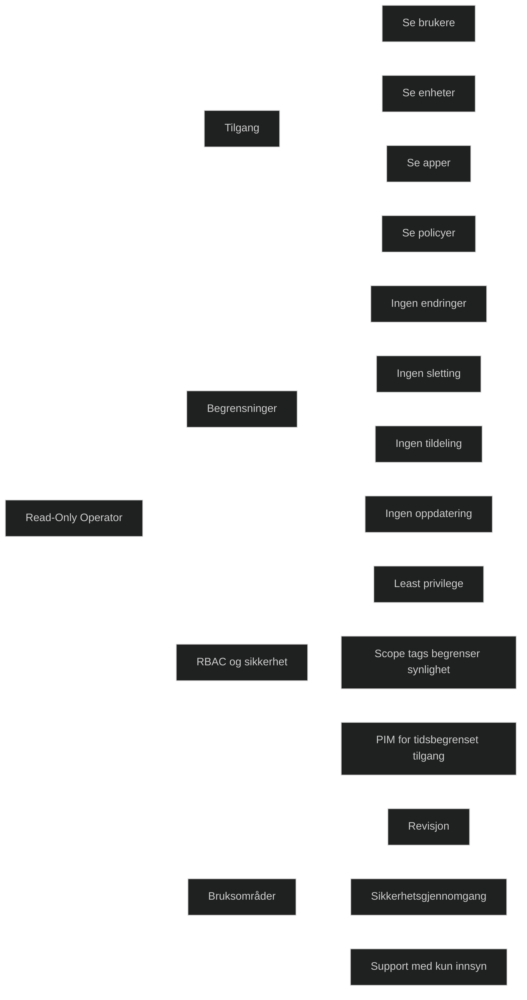

_Read‑Only Operator_ er en innebygd Intune‑rolle som gir _kun lesetilgang_ til Intune‑miljøet. Rollen kan se informasjon om brukere, enheter, apper, konfigurasjoner og policyer, men _kan ikke gjøre endringer_. Dette gjør rollen ideell for:

- revisjon
- sikkerhetsgjennomgang
- supportpersonell som kun trenger innsyn
- ledelse eller eksterne som skal inspisere uten å kunne påvirke miljøet

Ifølge Microsoft Learn kan Read‑Only Operator:

- «View user, device, enrollment, configuration, and application information»
- men _kan ikke endre noe som helst_ i Intune‑tenantet

Rollen følger prinsippet om _least privilege_, og er en trygg måte å gi innsikt uten risiko for utilsiktede endringer.

# Viktige egenskaper

- Full lesetilgang til alle relevante Intune‑objekter
- Ingen skrive, endre, slette eller tildele‑rettigheter
- Kan brukes sammen med scope tags for å begrense hva brukeren kan se
- Kan kombineres med Entra ID PIM for tidsbegrenset tilgang
- Kan brukes i revisjon og sikkerhetskontroll uten operasjonell risiko

# MD‑102

Read‑Only Operator er en del av Intune RBAC‑modellen, som er sentral i MD‑102. Rollen viser hvordan Intune:

- implementerer _least privilege_
- skiller mellom operativ og observasjonsbasert tilgang
- bruker _RBAC + scope tags_ for å kontrollere synlighet
- gir sikker delegasjon uten å kompromittere drift

_Read‑Only Operator_: innsyn i hele Intune
_Endpoint Privilege Reader_: innsyn kun i Endpoint Privilege Management

| Rolle                                                     | Hva den kan se                                                                 | Hva den ikke kan se | Typisk bruk                                     |
| --------------------------------------------------------- | ------------------------------------------------------------------------------ | ------------------- | ----------------------------------------------- |
| Read Only Operator                                        | Alt i Intune: enheter, apper, policyer, konfigurasjoner, compliance, rapporter | Kan ikke endre noe  | Revisjon, ledelse, support som trenger oversikt |
| [Endpoint-Privilege-Reader](Endpoint-Privilege-Reader.md) | Kun Endpoint Privilege Management: elevation rules, EPM‑policyer, rapporter    | Alt annet i Intune  | Sikkerhetsteam som kun skal inspisere EPM       |

[How to Assign a User an RBAC Role in Intune](https://help.devicie.com/kb/how-to-assign-a-user-an-rbac-role-in-intune)
