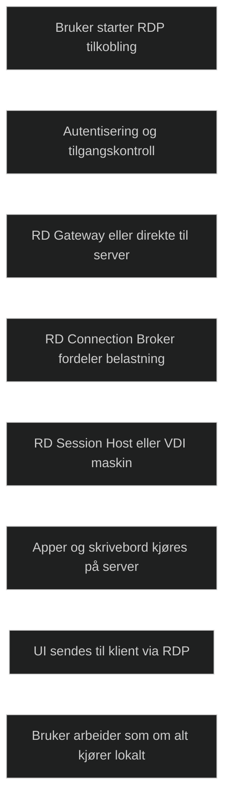

Remote Desktop Services er en plattform i Windows Server som gjør det mulig å levere skrivebord og applikasjoner fra sentrale servere til brukere uansett hvor de befinner seg. RDS sender bare brukergrensesnittet til klienten, mens all behandling skjer på serveren. Dette reduserer administrasjonsbehov, gir bedre sikkerhet og gjør det enklere å standardisere applikasjoner og arbeidsflater.

RDS støtter både fullstendige skrivebordssesjoner og publiserte apper gjennom RemoteApp. Det gir fleksibilitet i valg av ytelse, kostnad og kompatibilitet. Data forblir i datasenteret, og sikkerheten styrkes gjennom kryptert tilgang, flerfaktorautentisering og sentralisert administrasjon.

<a href="/certs/diagrams/deploy-rds.html" target="_blank" rel="noopener">Stort diagram</a>

[Remote Desktop Services overview in Windows Server | Microsoft Learn](https://learn.microsoft.com/en-us/windows-server/remote/remote-desktop-services/overview)