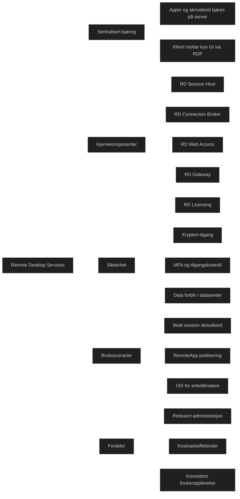

Remote Desktop Services er en rollebasert infrastruktur i Windows Server som lar autoriserte brukere koble seg til enten et fullstendig skrivebord eller enkeltapplikasjoner via RemoteApp. All kjøring skjer på serveren, mens klienten kun mottar brukergrensesnittet gjennom Remote Desktop Protocol. Dette reduserer administrasjon fordi apper installeres og vedlikeholdes ett sted, og brukere får en konsistent opplevelse uansett enhet. 

RDS støtter både multi session serverbaserte skrivebord og VDI baserte enkeltsesjonsmaskiner, slik at organisasjoner kan velge riktig modell for kostnad, ytelse og kompatibilitet. Data forblir i datasenteret, og sikkerheten styrkes gjennom kryptert tilgang, MFA og sentralisert kontroll. 

En komplett RDS infrastruktur består av flere roller: RD Session Host for å kjøre sesjoner, RD Connection Broker for lastbalansering og sesjonsgjenoppretting, RD Web Access for portaltilgang, RD Gateway for sikker ekstern tilgang og RD Licensing for lisenshåndtering. Disse rollene kan skaleres og distribueres etter behov. 

RDS brukes ofte når organisasjoner ønsker full kontroll over miljøet, data og infrastruktur, eller når applikasjoner krever serverbasert kjøring. Det gir høy tetthet per server, god kostnadseffektivitet og mulighet for avansert tilpasning og integrasjon. 

[Remote Desktop Services overview in Windows Server | Microsoft Learn](https://learn.microsoft.com/en-us/windows-server/remote/remote-desktop-services/overview)