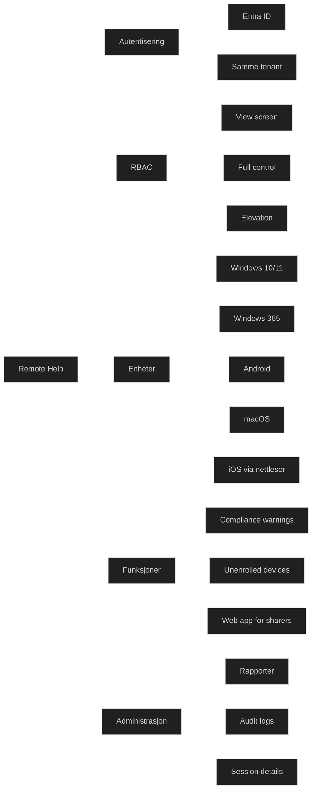

Remote Help er en _skybasert fjernstøtteløsning_ i Microsoft Intune som lar IT koble seg sikkert til brukeres enheter for feilsøking og støtte i sanntid. Løsningen krever at både hjelper og bruker logger inn med _Microsoft Entra ID_, noe som sikrer identitet og hindrer misbruk. Remote Help er tilgjengelig som _Intune Suite‑funksjon_ eller som et separat tillegg.

Remote Help skiller mellom:

- _Helper_ – IT‑personell som gir støtte
- _Sharer_ – brukeren som deler skjermen

Begge må være i samme tenant, og RBAC styrer nøyaktig hvilke handlinger en helper kan utføre.

### Viktige funksjoner

- _Sikker tilkobling via Entra ID_
- _RBAC‑styrt tilgang_ for å kontrollere hvem som kan se skjerm, ta kontroll eller utføre elevasjon
- _Compliance warnings_ før tilkobling hvis enheten ikke er kompatibel
- _Støtte for unenrolled devices_ dersom aktivert av administrator
- _Detaljerte rapporter og audit logs_ i Intune admin center
- _Web‑app for sharers_ hvis de ikke kan installere klienten

### Krav

- Intune‑abonnement
- Remote Help‑lisens, Intune Suite eller M365 E3/E5 for både helper og sharer
- Entra ID‑pålogging
- Remote Help‑appen installert (eller web‑app)

### Støttede plattformer

- Windows 10/11
- Windows 365
- Android (Samsung/Zebra)
- macOS
- iOS/iPadOS via nettleser

### MD‑102

Remote Help er en del av moderne endpoint‑administrasjon og viser hvordan Intune:

- bruker identitet som kontrollplan
- implementerer Zero Trust i støtteprosesser
- gir sikker fjernhjelp uten behov for VPN eller lokal admin
- bruker RBAC for å redusere risiko

