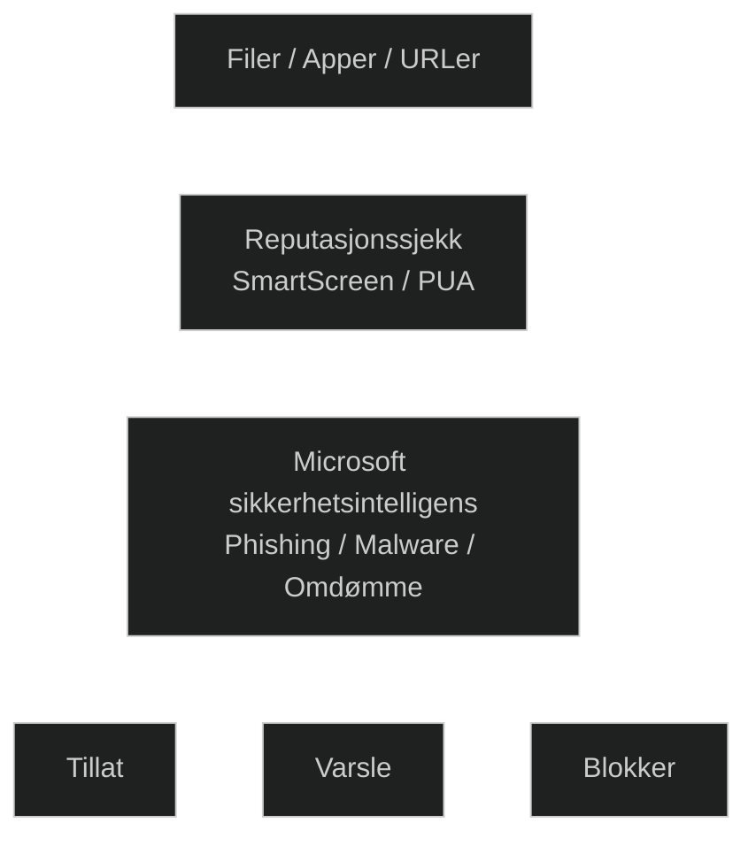

Reputation‑based protection i Windows Security er et sett med funksjoner som blokkerer filer, apper, nettsteder og nedlastinger som har dårlig eller ukjent omdømme basert på Microsofts sikkerhetsintelligens. Det beskytter mot:

- _Potensielt uønskede apper (PUA)_ som adware, bundlere og evasion‑programmer
- _Skadelige eller mistenkelige nedlastinger_ (SmartScreen sjekker filer mot kjente skadelige programmer og ser om filer mangler etablert omdømme)
- _Phishing og skadelige nettsteder_ ved å sjekke URL‑er mot Microsofts dynamiske lister over rapporterte phishing‑ og malware‑sider

Funksjonen ligger under _Windows Security → App & browser control → Reputation‑based protection_ og fungerer sammen med Microsoft Defender Antivirus og SmartScreen. Den gir et ekstra lag med beskyttelse ved å stoppe trusler før de får kjøre eller lastes ned.

