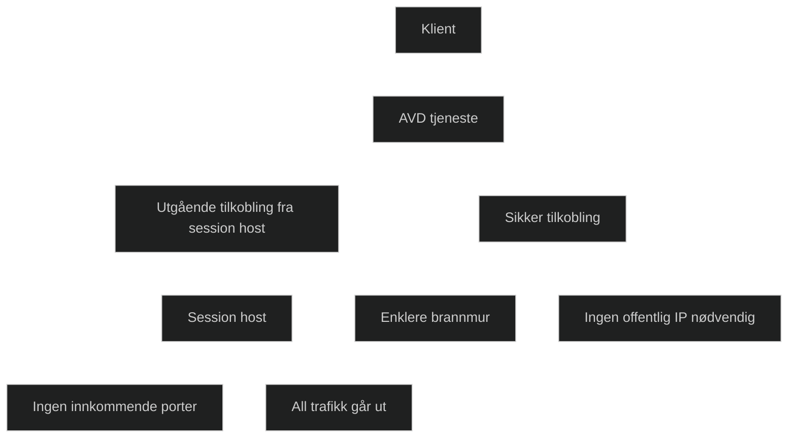

Reverse Connect er teknologien som gjør at Azure Virtual Desktop kan levere skrivebord og apper uten at du åpner innkommende porter i brannmuren. I stedet for at klienten kobler seg direkte til den virtuelle maskinen, oppretter session hosten en utgående tilkobling til Azure. Klienten kobler seg deretter til denne forbindelsen gjennom AVD tjenesten.

Dette betyr at all trafikk går ut fra session hosten, og ingen innkommende trafikk trenger å tillates. Det gir enklere nettverkskonfigurasjon, bedre sikkerhet og mindre risiko for angrep. Reverse Connect gjør det også mulig å bruke AVD i miljøer med strenge brannmurregler eller uten offentlig IP adresse.

Teknologien brukes av alle AVD klienter, inkludert Windows, macOS, iOS, Android og nettleser. Den er en av hovedgrunnene til at AVD er enklere å sette opp enn tradisjonelle RDS miljøer.

