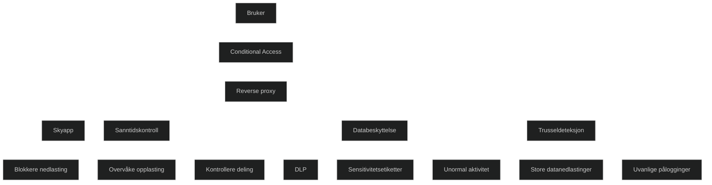

En reverse proxy i Microsoft Defender for Cloud Apps brukes for å overvåke og kontrollere sanntidsaktivitet i skyapper uten at brukeren må installere noe. Den fungerer som et mellomledd mellom brukeren og skyappen, slik at all trafikk kan analyseres og styres før den når tjenesten. Dette gjør det mulig å håndheve policyer i sanntid, som blokkering av nedlasting, overvåking av opplasting, kontroll av deling og beskyttelse av sensitiv informasjon.

Reverse proxy brukes ofte sammen med Conditional Access i Microsoft Entra ID. Når en bruker oppfyller bestemte betingelser, sendes trafikken via proxyen. Dette gir dyp innsikt i brukeratferd og gjør det mulig å stoppe risikofylt aktivitet umiddelbart, for eksempel når en bruker forsøker å laste ned store mengder data eller dele filer utenfor virksomheten.

Løsningen støtter mange populære skyapper, inkludert Microsoft 365, Google Workspace og Salesforce. Den er viktig i MD 102 fordi den viser hvordan sanntidskontroll av skyapper kan brukes for å beskytte data, redusere risiko og oppdage mistenkelig aktivitet.

<a href="/certs/diagrams/defender-reverse-proxy.html" target="_blank" rel="noopener">Stort diagram</a>