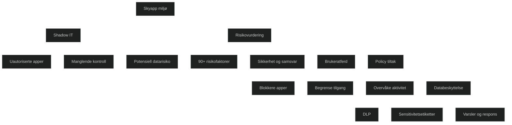

Risikovurdering handler om å evaluere hvor trygge eller utrygge skyapper er. Microsoft Defender for Cloud Apps bruker en omfattende appkatalog med mer enn 90 risikofaktorer, som datasikkerhet, sertifiseringer, kryptering, tilgangskontroll, driftssikkerhet og hvordan leverandøren håndterer personvern. Hver app får en risikoscore som hjelper IT avdelingen med å avgjøre om appen kan brukes, bør blokkeres eller krever ekstra tiltak. Risikovurdering brukes også på brukeratferd, for eksempel store datanedlastinger, uvanlige pålogginger eller mistenkelige OAuth tillatelser. I MD 102 er dette sentralt fordi du må kunne forklare hvordan risiko vurderes og hvordan dette styrer policyer og tiltak i skyen.

<a href="/certs/diagrams/defender-risiko-shadowy.html" target="_blank" rel="noopener">Stort diagram</a>