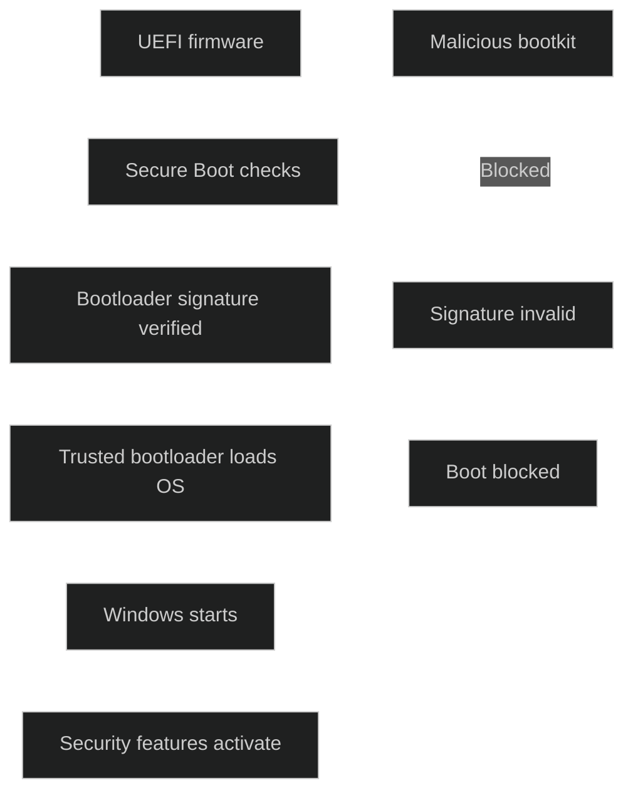

Secure Boot er en sikkerhetsfunksjon i UEFI som sørger for at bare _signert og klarert programvare_ får lov til å starte under oppstart. Dette beskytter systemet mot skadevare som angriper før operativsystemet lastes, som bootkits og rootkits.

Secure Boot kontrollerer digitale signaturer på bootloadere og drivere, og blokkerer alt som ikke er godkjent. Dette skaper en _kjede av tillit_ fra firmware til operativsystemet.

Sertifikatene som brukes til å validere denne kjeden må oppdateres jevnlig. Microsoft ruller nå ut nye Secure Boot sertifikater fordi de gamle utløper i 2026. Oppdateringene distribueres via Windows Update, og Windows Security viser status for om enheten har mottatt dem.

Secure Boot er kritisk for moderne Windows sikkerhet fordi det hindrer at ondsinnet kode får kjøre før antivirus og andre sikkerhetsmekanismer er aktive.

[Secure Boot certificate update status in the Windows Security app - Microsoft Support](https://support.microsoft.com/en-us/topic/secure-boot-certificate-update-status-in-the-windows-security-app-5ce39986-7dd2-4852-8c21-ef30dd04f046)

[Refreshing the root of trust: industry collaboration on Secure Boot certificate updates | Windows Experience Blog](https://blogs.windows.com/windowsexperience/2026/02/10/refreshing-the-root-of-trust-industry-collaboration-on-secure-boot-certificate-updates)
[Secure Boot Explained: How to Enable and Why It’s Vital for Windows 11 Security | Windows Forum](https://windowsforum.com/threads/secure-boot-explained-how-to-enable-and-why-its-vital-for-windows-11-security.361457)
