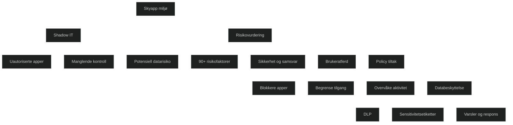

Shadow IT betyr bruk av skyapper, tjenester eller løsninger som ikke er godkjent eller administrert av IT avdelingen. Dette skjer ofte når ansatte tar i bruk apper som gjør arbeidet enklere, men uten at virksomheten har kontroll på sikkerhet, datalagring eller tilgang. Shadow IT skaper risiko fordi data kan havne i apper som ikke følger virksomhetens krav til beskyttelse, samsvar eller tilgangsstyring. Microsoft Defender for Cloud Apps oppdager slike apper ved å analysere trafikk og viser hvilke tjenester som brukes, hvem som bruker dem og hvor stor risiko de representerer. I MD 102 er dette viktig fordi du må kunne identifisere uautoriserte apper og håndtere dem gjennom policyer og risikovurdering.

<a href="/certs/diagrams/defender-risiko-shadowy.html" target="_blank" rel="noopener">Stort diagram</a>