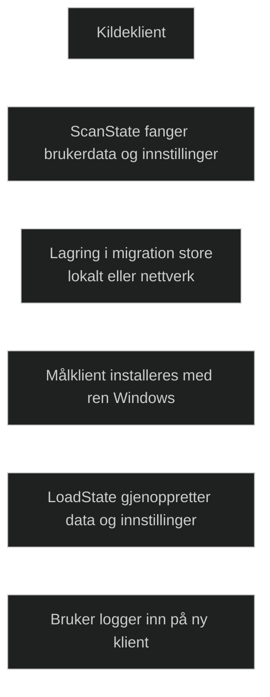

Side by side brukes når en bruker skal flyttes til en ny fysisk klient. Metoden innebærer at data og innstillinger fanges fra kildeklienten og lagres i en migration store, før de gjenopprettes på målklienten etter at Windows er installert. Dette gjøres vanligvis med [User State Migration Tool](User-State-Migration-Tool.md) , som bruker ScanState for å samle data og LoadState for å gjenopprette dem.

Metoden støtter migrering av brukerprofiler, dokumenter, operativsysteminnstillinger og applikasjonsinnstillinger, men applikasjonene selv må installeres på nytt. Den brukes ofte i større utrullinger der klienter byttes ut, og gir en ren og standardisert installasjon på målmaskinen.

