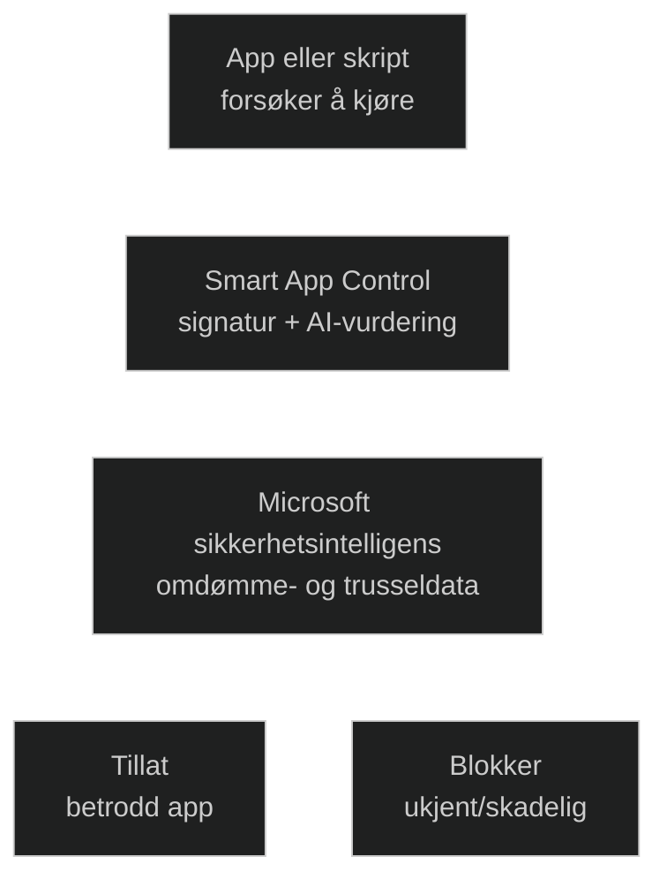

_Smart App Control (SAC)_ er en sikkerhetsfunksjon i Windows 11 som automatisk blokkerer apper og skript som ikke har et kjent og betrodd omdømme. Den bruker _Microsofts cloud‑baserte omdømmetjenester + kodeintegritetsregler + AI‑basert vurdering_ for å avgjøre om en app skal få kjøre.

Den beskytter mot:

- ukjente apper uten signatur
- skadelige eller manipulerte apper
- skript og prosesser som ikke har etablert tillit
- apper som prøver å kjøre utenfor normale installasjonsflyter

SAC har tre moduser:

- _On_ – blokkerer ukjente apper automatisk
- _Evaluation_ – analyserer app‑bruk og avgjør om On‑modus er trygg
- _Off_ – kan ikke slås på igjen uten reinstallasjon (clean install‑krav)

Microsoft beskriver SAC som et “zero trust for consumer apps”‑lag.

