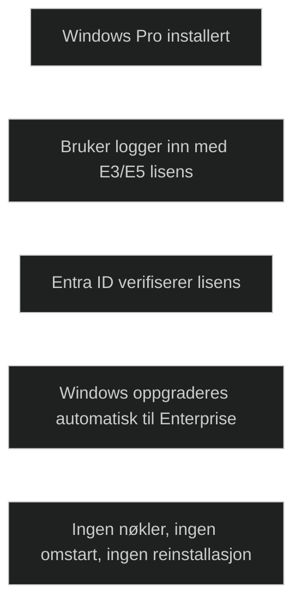

Subscription Activation gjør det mulig å aktivere og oppgradere Windows basert på _brukerens lisens_, ikke maskinens. Når en bruker med _Windows Enterprise E3 eller E5_ logger inn på en Windows Pro klient, oppgraderes systemet automatisk til Enterprise så lenge maskinen er:

- på en kvalifisert Windows versjon
- Microsoft Entra joined eller hybrid joined
- tilknyttet en bruker som har gyldig abonnement

Dette eliminerer behovet for:

- KMS eller MAK
- GVLK nøkler
- manuell aktivering
- omstart etter oppgradering

Subscription Activation fungerer også for utdanningsmiljøer (Pro Education → Education) og kan brukes i både skybaserte og hybrid miljøer. Organisasjoner med Enterprise Agreement kan bruke funksjonen på tradisjonelle AD joined klienter så lenge brukeren er synkronisert til Entra ID.

Det er viktig å merke seg at Subscription Activation _ikke_ oppgraderer til nyere Windows versjoner, kun til høyere utgaver innen samme versjon.

