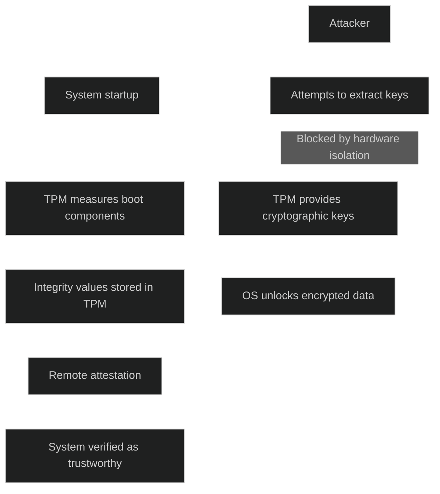

TPM er en _maskinvarebasert sikkerhetsmodul_ som beskytter kryptografiske nøkler, måler systemintegritet og bidrar til sikker oppstart. Den er designet for å være fysisk manipulasjonssikker og utfører kryptografiske operasjoner i et isolert miljø.

TPM brukes til å:

- generere, lagre og beskytte kryptografiske nøkler
- autentisere enheter ved hjelp av en unik RSA nøkkel som ligger brent inn i brikken
- måle og lagre integritetsdata fra oppstartsprosessen for å sikre at systemet starter i en kjent og tillitbar tilstand
- lagre passord, sertifikater og andre autentiseringsdata på en måte som er svært vanskelig å hente ut uten autorisasjon

TPM brukes i Windows for funksjoner som BitLocker, autentisering, attestasjonsmekanismer og beskyttelse mot phishing ved at nøkler aldri forlater TPM‑brikken. Den er også et krav for Windows 11.

[Trusted Platform Module Technology Overview | Microsoft Learn](https://learn.microsoft.com/en-us/windows/security/hardware-security/tpm/trusted-platform-module-overview)
[Trusted Platform Module (TPM) Summary | Trusted Computing Group](https://trustedcomputinggroup.org/resource/trusted-platform-module-tpm-summary)
[Trusted Platform Module - Wikipedia](https://en.wikipedia.org/wiki/Trusted_Platform_Module)