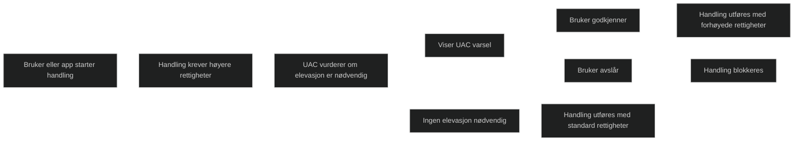

User Account Control er en sikkerhetsfunksjon i Windows som hindrer uautoriserte endringer i operativsystemet. Når en handling krever administratorrettigheter, viser UAC et varsel som ber brukeren godkjenne eller avvise endringen. Dette beskytter systemet mot skadelig programvare som forsøker å få forhøyede rettigheter uten samtykke. UAC er aktivert som standard og bygger på prinsippet om minst mulig privilegium ved å kjøre apper med standard brukerrettigheter og kun heve rettighetene når det er nødvendig.

UAC skiller mellom vanlige brukeroppgaver og administrative handlinger. Selv brukere som er medlemmer av administratorgruppen kjører normalt med standard brukerrettigheter og må godkjenne elevasjon når en app eller handling krever det. Dette reduserer risikoen for stille systemendringer og begrenser skadeomfanget dersom skadelig kode kjøres.

<a href="/certs/diagrams/uac.html" target="_blank" rel="noopener">Stort diagram</a>

[User Account Control | Microsoft Learn](https://learn.microsoft.com/en-us/windows/security/application-security/application-control/user-account-control)
[Windows User Account Control (UAC): How It Works and How to Configure It Safely | MalwareTips Forums](https://malwaretips.com/resources/windows-user-account-control-uac-how-it-works-and-how-to-configure-it-safely.15)