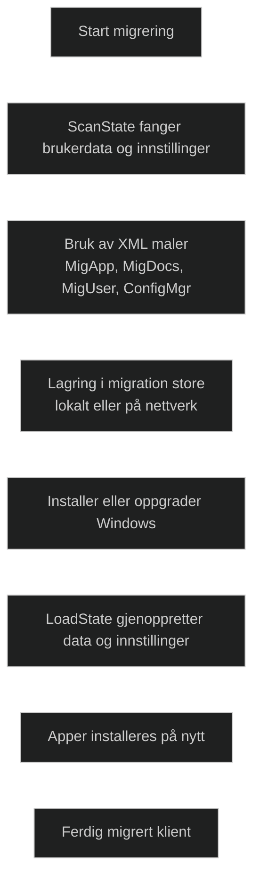

_User State Migration Tool (USMT)_ er Microsofts verktøy for å migrere brukerdata og innstillinger når en klient skal oppgraderes eller reinstalleres. Det brukes i større miljøer der prosessen må være automatisert og forutsigbar.

USMT består av to hovedverktøy:

- _ScanState_ – fanger brukerdata og innstillinger
- _LoadState_ – gjenoppretter data på målklienten

USMT bruker XML maler (MigApp, MigDocs, MigUser, ConfigMgr) som definerer hva som skal tas med eller utelates. Dette gjør det mulig å standardisere migreringen og unngå uønsket data.

USMT brukes i både _Side by side_ og _Wipe and load_, og kan integreres i Configuration Manager via State Migration Point og Task Sequences. Det støtter også offline migrering via Windows.old når en støttet Windows versjon oppgraderes.

USMT migrerer _ikke apper_, kun data og innstillinger. Apper må installeres på nytt etterpå.

