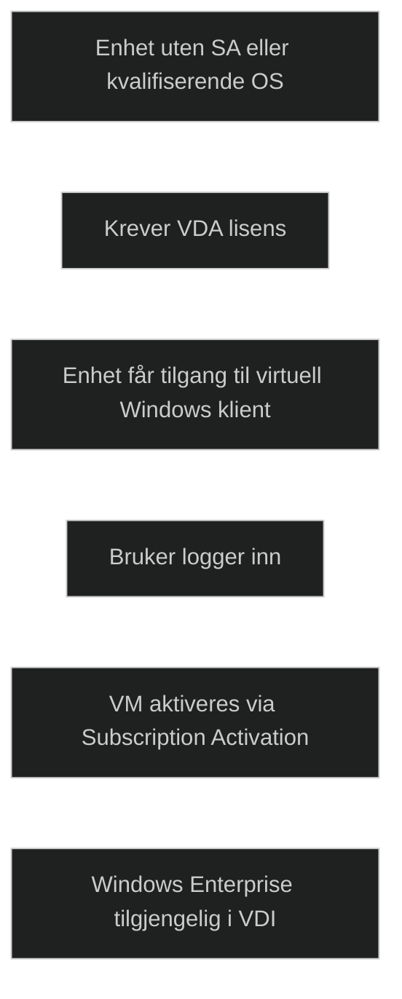

Virtual Desktop Access brukes for å gi tilgang til en Windows virtuell desktop i miljøer der enheten ikke har innebygde rettigheter til å kjøre eller aksessere en Windows klient i et VDI miljø.

_Windows VDA er en abonnementsbasert lisens per enhet_, og brukes typisk for tynne klienter, kiosker, delte enheter eller privateide maskiner. Den gir rett til å koble seg til en Windows Enterprise virtuell maskin.

Enheter som allerede har _Windows Enterprise med Software Assurance_ eller brukere med _Microsoft 365 E3/E5_ trenger vanligvis ikke VDA, siden disse lisensene inkluderer rettigheter til å aksessere virtuelle Windows klienter.

VDA brukes også i scenarioer der virtuelle maskiner aktiveres via _Windows Subscription Activation_, som automatisk oppgraderer VM til Enterprise når en lisensiert bruker logger inn. Dette gjør at man slipper KMS eller MAK i skybaserte miljøer.

