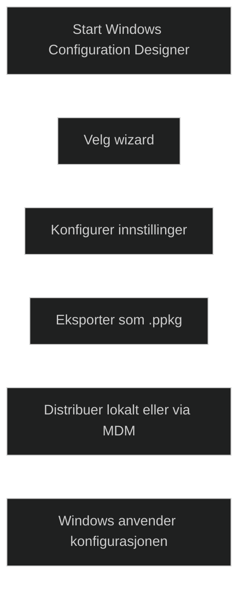

Windows Configuration Designer brukes til å lage _provisioning packages (.ppkg)_ som konfigurerer Windows raskt uten reinstallasjon. Verktøyet gjør det mulig å definere innstillinger som kontoer, nettverk, apper, sertifikater, sikkerhetskrav og tilpasninger.

WCD tilbyr flere veivisere som forenkler arbeidet, blant annet for desktop, mobile og kiosk scenarier. Når pakken er ferdig, eksporteres den som en .ppkg fil som kan brukes både under første oppstart og på en eksisterende Windows installasjon.

Provisioning packages er nyttige når:

- nettverk ikke er tilgjengelig
- Autopilot ikke kan brukes
- man trenger rask lokal konfigurasjon
- man vil standardisere Windows uten imaging

Dette gjør WCD til et fleksibelt verktøy i moderne utrulling, og et viktig tema i MD‑102.

