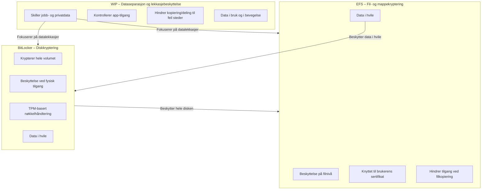

Windows Information Protection beskrives som en mekanisme for å redusere risikoen for utilsiktet datalekkasjer i et miljø der ansatte jobber på både private og virksomhetseide Windows‑enheter. Løsningen skiller tydelig mellom personlig og virksomhetsdata, beskytter bedriftsinnhold i apper og på lagringsmedier, og gjør det mulig å fjerne tilgang til virksomhetsdata uten å berøre privat innhold. Dette er særlig relevant i moderne drift der BYOD, mobilitet og hybride arbeidsformer er normen.

WIP bygger på prinsippet om at tilgangskontroll alene ikke er nok; data må beskyttes også etter at det er åpnet i apper eller flyttet mellom lagringssteder. Derfor kombineres policyer, app‑kontroll og kryptering for å hindre at bedriftsdata kopieres, deles eller lagres i ikke‑godkjente apper eller tjenester. Administrasjon skjer gjennom Intune eller annen MDM‑løsning, og policyene kan settes til å blokkere, advare, tillate overstyring eller kun logge brudd.

Løsningen gir fleksibilitet i hvordan data håndteres: beskyttede apper kan lese og skrive virksomhetsdata, mens ikke‑godkjente apper begrenses etter valgt policy. Kryptering skjer automatisk når innhold lastes ned fra godkjente kilder eller merkes som arbeidsrelatert. Ved tap av tilgang, fratakelse av rettigheter eller avslutning av arbeidsforhold kan virksomhetsdata gjøres utilgjengelig uten å påvirke privat innhold.

For MD‑102 er hovedpoenget å forstå hvordan WIP inngår i helheten av databeskyttelse:

- skille mellom personlig og virksomhetsdata
- kontrollere hvilke apper som kan håndtere bedriftsinnhold
- hindre kopiering, deling og lagring til ikke‑godkjente steder
- bruke kryptering for å beskytte data i hvile
- kunne fjerne tilgang til bedriftsdata uten å slette privat innhold

Selv om teknologien er avviklet for fremtidige Windows‑versjoner, er prinsippene og mekanismene fortsatt relevante for drift av eksisterende miljøer og for forståelsen av moderne databeskyttelse i MD‑102.

[Protect your enterprise data using Windows Information Protection](https://learn.microsoft.com/en-us/previous-versions/windows/it-pro/windows-10/security/information-protection/windows-information-protection/protect-enterprise-data-using-wip)