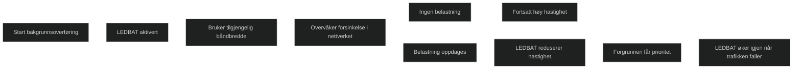

LEDBAT er en mekanisme for bakgrunnsoverføringer i Windows som bruker tilgjengelig båndbredde uten å skape forsinkelser for annen trafikk. Når nettverket er ledig, bruker LEDBAT mest mulig kapasitet. Når det oppstår belastning, trekker LEDBAT seg raskt tilbake for å gi plass til trafikk som er viktigere. Dette gjør LEDBAT egnet for oppdateringer, distribusjoner og annen bakgrunnstrafikk som ikke må forstyrre brukerne. LEDBAT er innebygd i Windows TCP‑stakken og brukes blant annet av Windows Update, Configuration Manager og OneDrive.

## Forskjeller mellom LEDBAT og BITS

**LEDBAT**

- Bruker all tilgjengelig båndbredde når nettverket er ledig
- Trekker seg automatisk tilbake når det oppstår forsinkelser
- Krever ingen koordinering mellom klient, server eller nettverksutstyr
- Egnet for store bakgrunnsoverføringer som ikke må påvirke brukere

**BITS**

- Bruker ledig båndbredde, men med mer konservativ regulering
- Har innebygd gjenopptakelse, køhåndtering og tidsplanlegging
- Egnet for kontrollerte filoverføringer som må være stabile og forutsigbare
- Kan bruke BranchCache når aktivert

[Content management fundamentals - Configuration Manager | Microsoft Learn](https://learn.microsoft.com/en-us/intune/configmgr/core/plan-design/hierarchy/fundamental-concepts-for-content-management)
[LEDBAT Background Data Transfer for Windows | Microsoft Community Hub](https://techcommunity.microsoft.com/blog/networkingblog/ledbat-background-data-transfer-for-windows/3639278)