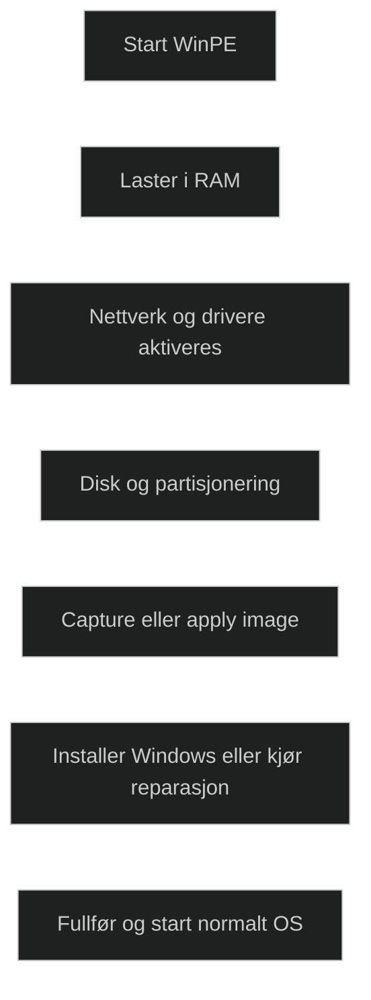

Windows PE er et lite operativsystem som brukes til å installere, distribuere og reparere Windows klient og server. Det kjører fra RAM og krever ikke lokal disk. Dette gjør det ideelt for oppstart av enheter som skal bygges, feilsøkes eller gjenopprettes. WinPE kan starte fra USB, ISO, PXE eller VHD, og er en del av Windows ADK som et eget tillegg.

WinPE støtter skripting, Win32 apper, nettverk, lagring, DISM, NTFS, BitLocker, TPM og Hyper V integrasjon. Det brukes til å klargjøre disker, installere Windows, fange og anvende image, og kjøre verktøy når Windows ikke er i drift. WinPE tilbakestilles ved hver omstart og er ikke ment som et permanent operativsystem.

Dette gjør WinPE til et sentralt verktøy i OS‑utrulling, spesielt i MDT og Configuration Manager, der boot image bygger på WinPE.

[Windows PE (WinPE) | Microsoft Learn](https://learn.microsoft.com/en-us/windows-hardware/manufacture/desktop/winpe-intro?view=windows-11)
[Windows Preinstallation Environment - Wikipedia](https://en.wikipedia.org/wiki/Windows_Preinstallation_Environment)
[What is Windows PE? Use, Limitations, Download and more](https://www.thewindowsclub.com/what-is-windows-pe)