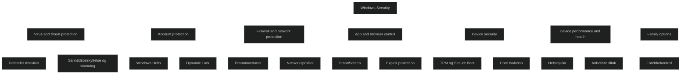

Windows Security er den innebygde sikkerhetskonsollen i Windows 10 og Windows 11. Den samler alle sentrale sikkerhetsfunksjoner i ett grensesnitt og gir brukeren oversikt over beskyttelsen av enheten. Løsningen bygger på Microsoft Defender teknologier og gir sanntidsbeskyttelse mot virus, skadevare, phishing, utrygge apper og nettverksangrep.

Windows Security fungerer som et kontrollsenter for:

- antivirus
- brannmur
- app og nettleserbeskyttelse
- enhetssikkerhet
- konto og identitetsbeskyttelse
- ytelse og helse
- familieinnstillinger

Dette gjør Windows Security til en kjernekomponent i Windows sin Zero Trust modell.

### Virus and threat protection

Sanntidsbeskyttelse, skanninger, karantene og Defender Antivirus funksjoner.

### Account protection

Styring av påloggingsmetoder som Windows Hello og Dynamic Lock.

### Firewall and network protection

Status og administrasjon av Windows Firewall for ulike nettverksprofiler.

### App and browser control

SmartScreen, exploit protection og kontroll av potensielt uønskede apper.

### Device security

Maskinvarebasert sikkerhet som TPM, Secure Boot og Core Isolation.

### Device performance and health

Rapporter om systemets tilstand og anbefalte tiltak.

### Family options

Verktøy for foreldrekontroll og familieadministrasjon.

# MD‑102 relevans

- forklare hva Windows Security er og hvilke områder den består av
- forstå hvordan Defender Antivirus, SmartScreen og brannmur styres herfra
- kjenne til maskinvarebaserte sikkerhetsfunksjoner som TPM og Core Isolation
- bruke Windows Security som feilsøkingsverktøy ved sikkerhetshendelser
- se hvordan Windows Security inngår i Zero Trust og endepunktbeskyttelse

<a href="/certs/diagrams/windows-security.html" target="_blank" rel="noopener">Stort diagram</a>
