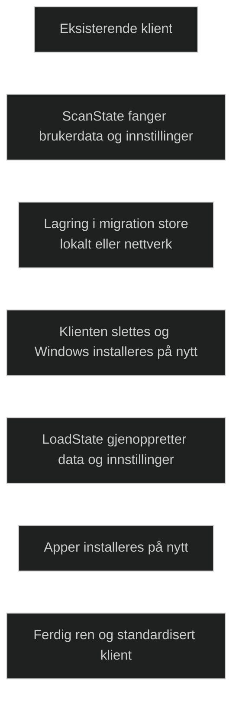

_Wipe and load_ er en migreringsmetode der den eksisterende klienten slettes fullstendig før Windows installeres på nytt. Brukerdata fanges først med USMT, lagres i en migration store, og gjenopprettes etter at operativsystemet er reinstallert.

Metoden brukes når:

- klienten skal bygges helt på nytt
- det finnes korrupsjon, ytelsesproblemer eller uønskede apper
- en eldre Windows versjon ikke kan oppgraderes direkte
- organisasjonen ønsker en ren og standardisert installasjon

Wipe and load gir et helt nytt miljø, men krever reinstallasjon av apper og kan føre til datatap hvis migreringen ikke er planlagt riktig. Den brukes ofte i større utrullinger og når klienten skal beholdes, men operativsystemet må erstattes.

