Work Folders er en funksjon i Windows som lar brukere _lagre og synkronisere arbeidsfiler_ mellom organisasjonens filserver og egne enheter. Poenget er å gi en _OneDrive‑lignende opplevelse_, men med data som fortsatt ligger på virksomhetens servere og følger interne sikkerhetspolicyer.

## Hva Work Folders gjør

- Synkroniserer arbeidsfiler mellom PC, mobil og nettbrett.
- Fungerer _offline_ – endringer lastes opp når enheten er på nett igjen.
- Gir brukeren en lokal mappe som automatisk holdes oppdatert mot serveren.
- Tilgjengelig på Windows, iOS og Android via Work Folders‑appen.

## Hvor lagres filene?

- På Windows lagres de i en dedikert Work Folders‑mappe.
- På mobile enheter lagres de i appens sikre lagring.
- Organisasjonen styrer hvor filene ligger på serveren.

## Sikkerhet

Work Folders kan kreve:
- kryptering av filer
- passkode på mobilen
- automatisk sletting av data ved policybrudd

Dette gjør at organisasjonen kan gi fleksibel tilgang uten å miste kontroll på data.

## Brukeropplevelse

- Brukeren får en mappe som fungerer som en vanlig filmappe.
- Filer kan åpnes i andre apper, inkludert Office.
- Appen viser om filer er oppdatert eller om det finnes synkroniseringsfeil.

```mermaid
%%{init: {
  "theme": "dark",
  "themeVariables": {
    "primaryColor": "#1e1e1e",
    "primaryTextColor": "#ffffff",
    "lineColor": "#ffffff",
    "secondaryColor": "#333333"
  }
}}%%
flowchart TD

    A[Work Folders] --> B[Hovedfunksjon]
    B --> B1[Lagre og synkronisere arbeidsfiler<br>mellom enheter og organisasjonens server]

    A --> C[Plattformer]
    C --> C1[Windows<br>innebygd støtte]
    C --> C2[iOS / Android<br>via Work Folders‑app]

    A --> D[Brukeropplevelse]
    D --> D1[Lokal mappe som synkroniseres automatisk]
    D --> D2[Fungerer offline<br>synkroniserer når online]
    D --> D3[Åpne filer i andre apper<br>inkl. Office]

    A --> E[Filhåndtering]
    E --> E1[Hvor lagres filer?<br>- Windows: lokal mappe<br>- Mobil: appens sikre lagring]
    E --> E2[Kan flyttes på PC<br>med begrensninger]

    A --> F[Sikkerhet]
    F --> F1[Kryptering av filer]
    F --> F2[Krav om passkode på mobil]
    F --> F3[Automatisk sletting ved policybrudd]

    A --> G[Feil og administrasjon]
    G --> G1[Varsler om synkroniseringsfeil]
    G --> G2[Mulighet for å stoppe bruk av Work Folders]
    G --> G3[Hjelp via Microsoft Support]


```

