Zero Trust er en sikkerhetsstrategi, ikke et produkt eller en tjeneste. Det er entilnærmingen til hvordan man utformer og implementeringen sikkerhet basert på et sett med grunnleggende prinsipper. 

Zero Trust består av tre hovedprinsipper:
- _Verify explicitly_: Autentiser og autoriser basert på alle tilgjengelige datapunkter
- _Use least privilege access_: Begrens tilgang med _Just-In-Time_ og _Just-Enough-Access_ (JIT/JEA), risikobaserte, adaptive policyer samt databeskyttelse
- _Assume breach_: Minimer skadeomfang og segmenter tilgang. Verifiser ende til ende kryptering og bruk analyse for å få innsikt, oppdage trusler og styrke sikkerheten

### Zero Trust i MD-102
Handler om hvordan du 
- konfigurer
- håndhever
- administrerer 

sikkerhet på enheter, brukere og apper gjennom _Entra ID, Intune og Defender_.

#### 1. Verify explicitly

Autentiser og autoriser basert på alle tilgjengelige signaler:

- Conditional Access
- MFA og passordløse metoder
- Identity Protection (bruker‑ og påloggingsrisiko)
- Intune‑compliance og device state
- App protection (MAM) som verifikasjonsmekanisme
- Network access signals (VPN, per‑app VPN)
- Continuous Access Evaluation (CAE)
- Identity lifecycle (join → manage → retire)

#### 2. Use least privilege access

Gi brukere og enheter kun den tilgangen de trenger:

- JIT/JEA
- RBAC i Intune
- App‑basert Conditional Access
- Risikobasert tilgang
- Intune‑policyer (MDM)
- MAM‑policyer for BYOD
- Policy stacking: CA + compliance + MAM + config

### **3. Assume breach**

Anta at noe kan gå galt, og begrens skadeomfanget:

- Segmentering av tilgang (grupper, roller, CA)
- Defender for Endpoint (trusseloppdagelse)
- Ende‑til‑ende kryptering (BitLocker, app‑kryptering)
- Logging og overvåkning (Entra ID, Defender)
- Session controls (Defender for Cloud Apps)
- Automatiserte responser basert på risiko

### Zero Trust i MD‑102 – hva du faktisk gjør

I MD‑102 handler Zero Trust om hvordan du:

### **Konfigurerer**

- Entra ID identitetskontroll
- Intune‑registrering og compliance
- Defender‑integrasjon

### **Håndhever**

- Conditional Access
- Compliance‑krav
- App‑beskyttelse (MAM)
- Policy stacking

### **Administrerer**

- Logging og overvåkning
- Risiko‑baserte tiltak
- Kontinuerlig evaluering av enheter og brukere

```mermaid
%%{init: {
  "theme": "dark",
  "themeVariables": {
    "primaryColor": "#1e1e1e",
    "primaryTextColor": "#ffffff",
    "lineColor": "#ffffff",
    "secondaryColor": "#333333"
  }
}}%%

flowchart TD

    ZT["Zero Trust<br/>Never trust, always verify"]

    %% PRINCIPLES
    subgraph Principles["Zero Trust – tre prinsipper"]
        direction TB
        VE["Verify explicitly"]
        LPA["Least privilege access"]
        AB["Assume breach"]
    end

    %% MD-102 CONTEXT
    subgraph MD102["Zero Trust i MD‑102"]
        direction TB
        CONF["Konfigurer<br/>• Entra ID • Intune • Defender"]
        ENF["Håndhev<br/>• CA • Compliance • App‑beskyttelse"]
        ADM["Administrer<br/>• Logging • Risiko • Overvåkning"]
    end

    %% VERIFY EXPLICITLY
    subgraph Verify["Verify explicitly – mekanismer"]
        direction TB
        CA["Conditional Access"]
        MFA["MFA / passordløs autentisering"]
        IDP["Identity Protection<br/>• risiko for bruker/pålogging"]
        COMP["Compliance‑policyer (Intune)"]
        DEVSTATE["Device state<br/>• compliant • hybrid join • managed"]
        MAMV["App protection (MAM) som verifikasjon"]
        CAE["Continuous Access Evaluation (CAE)"]
        NETSIG["Network access signals<br/>• VPN • per‑app VPN"]
        LIFECYCLE["Identity lifecycle<br/>• join → manage → retire"]
    end

    %% LEAST PRIVILEGE
    subgraph LeastPriv["Least privilege access – mekanismer"]
        direction TB
        JIT["JIT/JEA"]
        RBAC["RBAC i Intune"]
        APPCA["App‑basert CA"]
        RISK["Risikobasert tilgang"]
        INTUNE["Intune‑policyer (MDM)"]
        MAM["MAM‑policyer<br/>• databeskyttelse uten full kontroll"]
        STACK["Policy stacking<br/>• CA + compliance + MAM + config"]
    end

    %% ASSUME BREACH
    subgraph Assume["Assume breach – mekanismer"]
        direction TB
        SEG["Segmentering av tilgang<br/>• grupper • roller • CA"]
        DEF["Defender for Endpoint<br/>• trusseloppdagelse"]
        ENC["Ende‑til‑ende kryptering<br/>• BitLocker • app‑kryptering"]
        LOG["Logging og overvåkning<br/>• Entra ID • Defender"]
        SESSION["Session controls<br/>• Defender for Cloud Apps"]
        AUTO["Automatiserte responser basert på risiko"]
    end

    %% Connections
    ZT --> Principles
    ZT --> MD102

    VE --> Verify
    LPA --> LeastPriv
    AB --> Assume

    MD102 --> Verify
    MD102 --> LeastPriv
    MD102 --> Assume

```

